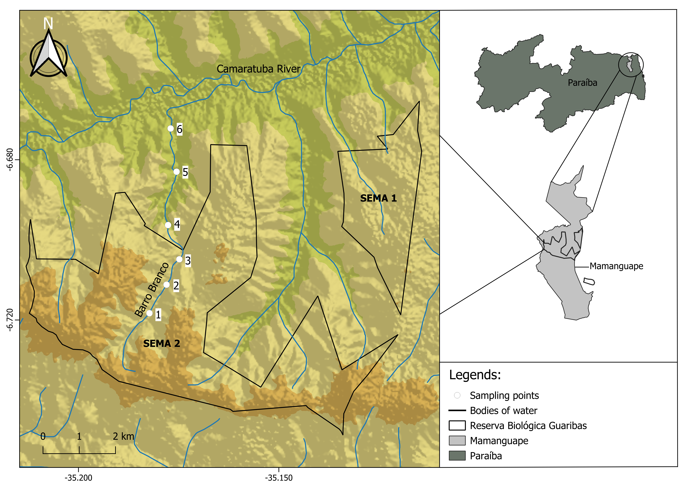
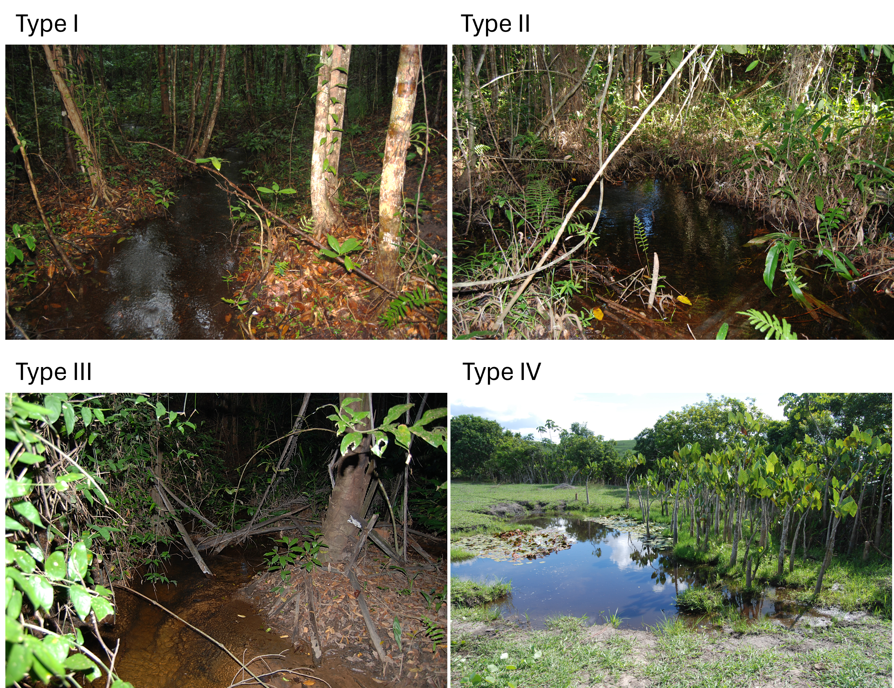
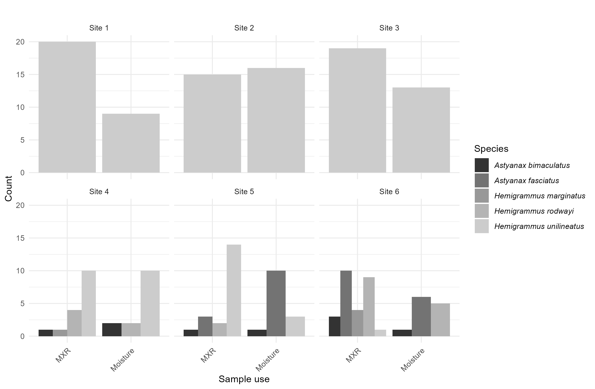
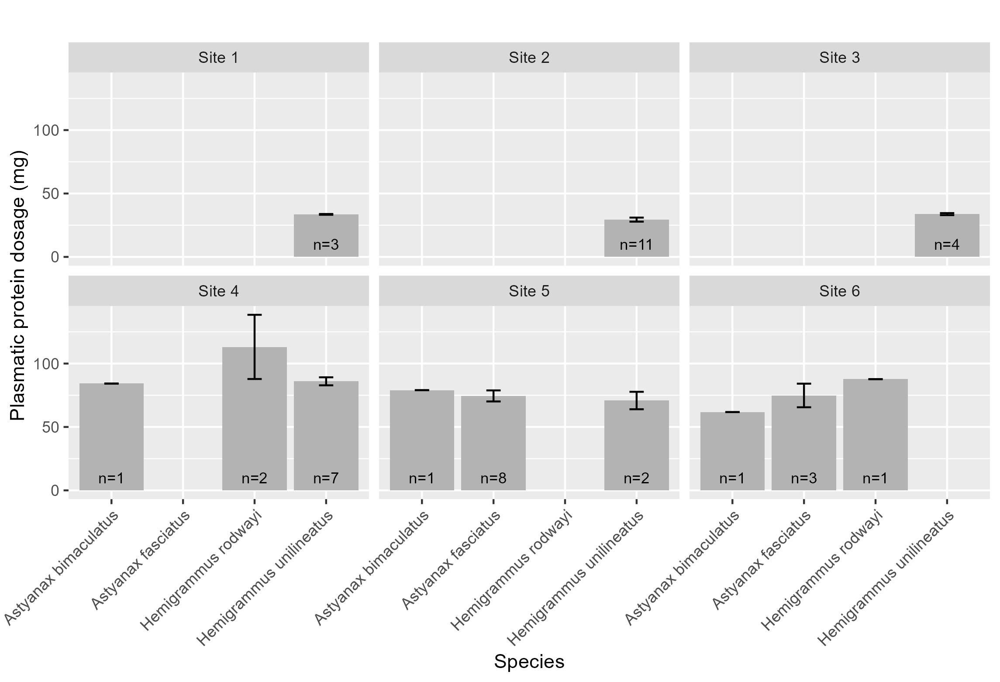
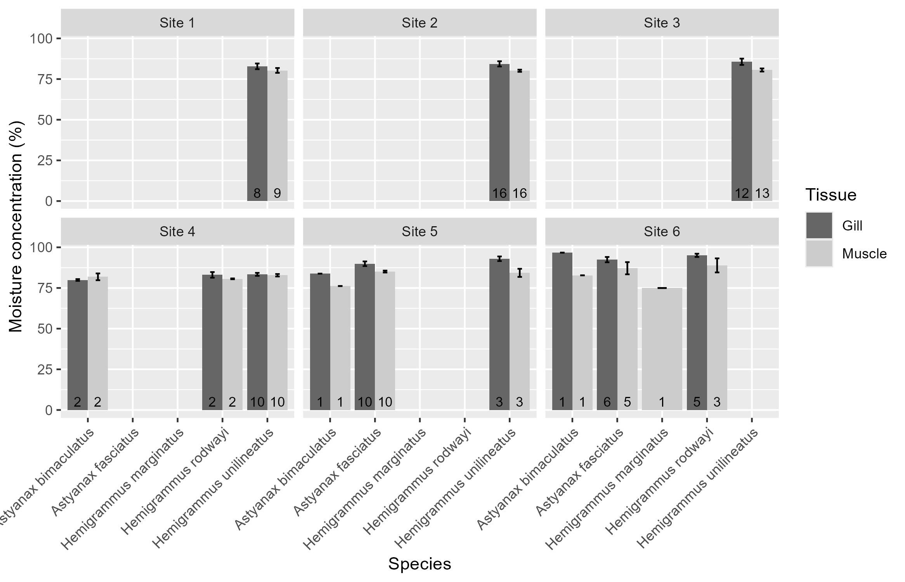
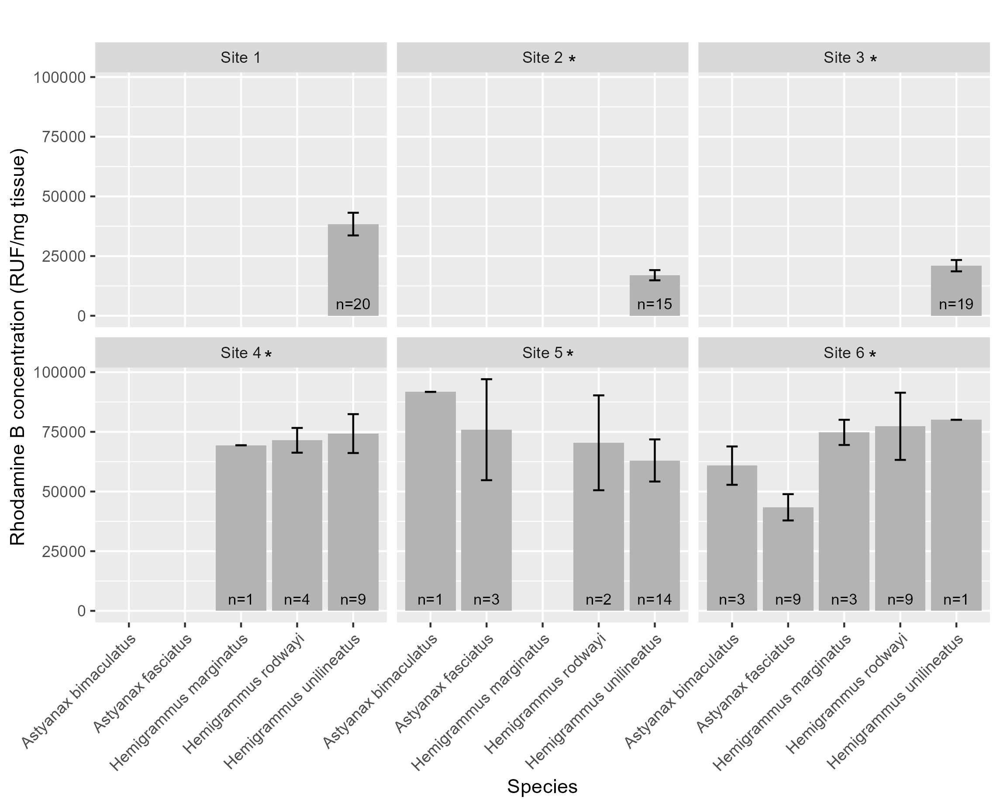

# Introduction

The Atlantic Forest is one of the world's most important biodiversity hotspots [@myers2000]. Despite occupying only a small fraction of its original distribution, it continues to support extraordinary levels of species richness and endemism [@marques2021]. At the same time, it is one of the most threatened tropical ecosystems on Earth due to habitat loss, fragmentation, urban expansion, and agricultural development [@theatla2021]. Conservation efforts in the Atlantic Forest have traditionally focused on terrestrial organisms such as plants, birds, and mammals. However, freshwater ecosystems are equally dependent on forest integrity and are often overlooked in conservation planning [@gouveia2017; @abilhoa2011].

@padial2021 mention a wide range of threats to aquatic systems that can affect the Atlantic Forest, ranging from dam construction and flow alterations to the emerging threat of microplastic contamination [@eerkes-medrano2018]. Pollution, from pesticides, fertilizers, heavy metals, pharmaceuticals or microplastics [@harmon2018; @evans1987], come mostly from urban and agricultural sources, and untreated urban sewage is amongst the most common [@costa2020]. In agricultural areas, fish farming, ⁠agricultural runoff, and the ⁠destruction of riparian forests, remain as important threats to aquatic ecosystem integrity [@padial2021].

Ecological responses to pollution, often become visible only after environmental impacts have already affected freshwater organisms [@macêdo2019]. Furthermore, the toxicity responsible for behavioral change depends on the organism, time of exposure and particle type, which demonstrates the need for physiological studies, specially in natural environments [@amoatey2019]. For these reasons, physiological biomarkers can provide particularly valuable early-warning indication [@ondei2020], as physiological, morphological and behavioural changes os species are affected in the ecosystem.

Fish are among the most widely used organisms to evaluate the health of aquatic systems, since their biochemical and physiological changes serve as biomarkers of environmental pollution [@cazenave2009; @ondei2020]. One of the main physiological functions affected by pollutants is the osmoregulation, and its associated pH control. Both are predominantly done by gills, and are critical to gas exchange, ionic regulation and nitrogen excretion [@evans1987]. The effects of this action on fish can be measured through a few blood markers, mainly lower levels of Chloride and Sodium ions, obtained by freshwater fish through exchange with internal ions [@evans1987], and higher levels of plasmatic proteins [@sabae2015]. This osmoregulation impairment and consequent decrease in plasma ionic concentration can represent an osmotic challenge for tissues. The hydration level of gills and muscles is another physiological parameter associated with an animal's capacity to cope with environmental pollution and is therefore subject to measurable changes induced by toxic compounds present in the environment. This active control was suggested by @ayrapetyan2012 as a universal biomarker for detecting pollution in the environment [@david2018; @sabae2015].

Another relevant biomarker is the abnormal activity of the multixenobiotic resistance (MXR) phenotype [@bard2000; @zaja2006], an innate gene of many aquatic species that is expressed in organs such as gills, kidneys, blood-brain barrier, liver and pancreas. It is activated by exposure to pollutants and results in the expression of P-glycoproteins (Pgp) in the membrane, which act to remove endogenous or exogenous toxic compounds out of the cell, protecting DNA and inducing toxic compounds excretion [@smital1998]. Although the MXR activity explains how some species are more resistant to the presence of pollutants, some substances can reverse its effectiveness, being called chemosensitizers (or simply MXR-inhibitors) [@smital2004]. Those compounds can interact with the Pgp activity, altering the mechanism regulation, and saturate or even reverse MXR activity. By saturating the Pgp pump, these chemosentizers allow other xenobiotics to enter the cell and increase its toxicity, even if the chemosensitizers themselves are not toxic. Precisely because they are mostly organic, natural, primarily harmless and very present in the materials emitted anthropogenic in nature, its detection should also be a priority in environmental risk studies [@kurelec2000].

In the present study, the hypothesis of markers linked to physiological stress of fish providing evidence of the environmental stress was tested along a headwater stream that originates withing a protected area - Biological Reserve, or REBIO, according to @brasil2000 - and its course extends beyond its administrative boundaries [@mma2003]. Given the importance of the Atlantic Forest to the biodiversity [@pereira2026], we aim with this study, (1) to identify physiological stress biomarkers in fish from a headwater stream, (2) to associate these biomarkers to the ecological health of sites inside and surrounding a protected area of Atlantic Forest. This will enable decision makers to take action on the influence of anthropogenic threats and the ecological consequence of pollution exposure of the buffer zone.

# Material and Methods

**Study area and sampling design.** This study was conducted in the Guaribas Biological Reserve (REBIO Guaribas), a protected area of Atlantic Forest in in northeastern Brazil. The reserve is located in the municipality of Mamanguape, state of Paraíba, in a heterogeneous landscape influenced by the adjacent Caatinga ecoregion. It was created in 1990 to preserve one of the last remnants of the Atlantic Forest in the region [@mma2003]. Despite a REBIO being one of the most restricted types of protected areas [@brasil2000], there are a number human settlements in its buffer zone. The management plan for the REBIO states several rural communities directly surrounding the reserve (Caiana, Pepina, Imbiribeira, Brejinho, Água Fria, João Pereira and Piabuçu), in addition to indigenous human populations (mostly the Potiguaras) [@mma2003]. These populations are important because of their historic patterns of ocupation and land use, but also because their agricultural activities, fishing, modification of the natural vegetation for livestock and overal use of the natural resources from the buffer zone directly affect the conservation of the REBIO. This has been aggravated in recent years by large scale use of water and land for cultivation of monocultures, like sugarcane [@heinrichs2017]. The surrounding landscape is predominantly agricultural, including coconut plantations, livestock farming, orchards subsistence agriculture. These land uses can act as sources of diffuse pollution, especially through pesticide runoff and domestic effluents, creating a spatial gradient of environmental disturbance [@mma2003; @soler2004]. Thus, the landscape is mainly rural and the land use causes direct impact to aquatic systems, by causing siltation of streams and contaminating groundwater through the use of septic tanks and releasing agricultural chemicals into the soil [@arruda2013; @mma2026]

The climate in the region is classified as As', characterized by a rainy season from February to July and a dry period from October to December [@peel2007]. The average annual temperature varies from 24 to 26 °C, while the annual rainfall varies between 1,750 and 2,000 mm. The hydrographic network is composed of small headwater streams fed by rain, notably the Barro Branco and Caiana streams, both tributaries of the Camaratuba River [@gouveia2017].

Sampling was conducted along the Barro Branco stream between November 2023 and February 2024, comprising six sampling sites. The sampling sites were distributed longitudinally to capture environmental variability and gradients of human influence. Sites P1 to P3 were located within the reserve, where more preserved conditions were expected, while sites P4 to P6 were situated in the buffer zone adjacent to areas with greater human influence (@fig-mapa).

For the sake of comparison, we classified all sites into four categories defined *a priori* (@fig-refsites). Reference site or Type I site, which are the sites that occur within the protected area and are well preserved, with intact riparian forest and no crop fields nearby (at least 1 km distant), free flowing water (≥ 0.25 m/s), high dissolved oxygen concentration (≥ 6 mg/L) and temperature below 28 °C. Type II sites, are those that occur within the protected area, but are not well preserved, failing in one or more of the water quality criteria and/or having its riparian vegetation removed or managed. Type III sites are those outside the protected area but meet the water quality criteria for a type I site, and type IV sites are those that fall outside the protected area and are also disturbed, not meeting the water quality criteria for a type I site. Sites type III and IV were intentionally chosen not to meet the riparian forest and crop proximity criteria. Since they fall outside of the REBIO they are not expected to have intact riparian forest or to be at least 1 km distant from a crop field. These categories were latter confirmed using environmental data.

The ecophysiological evaluation of human impact on the forest, was mainly guided by the fish species inventory for the REBIO made by @gouveia2017. This study lists 18 species from five different orders: Characiformes (12 species), Perciformes (3 species), Synbranchiformes (1 species), Siluriformes (1 species) e Cyprinodontiformes (1 species). From those, two are exotic - *Oreochromis niloticus*, second most farmed fish species in the world and tolerant to osmotic variation, and *Poecilia reticulata*, largely used in mosquito control and resistant to stressful environments [@miranda2012]. The predominance of small fish inhabiting small basins is thought to lead to low dispersion and consequent isolation of populations [@gouveia2017], associated with the fact that most species in the study area are phylogenetic close (with the predominance of Characidae) and are widely distributed, offers an appropriate design to access the entire local ichthyofauna using a few species, namely the genuses *Hemigrammus* and *Astyanax*.

**Environmental data collection.** In order to quantitatively confirm the classification of site category types (I, II, III and IV), environmental characteristics of each site were assessed based on four sets of variables: (a) site morphology, (b) water quality, (c) sediment composition, and (d) marginal habitat structure. Site morphology was characterized by measuring stream width (cm) and depth (cm) from three randomly selected transects. Catchment-scale variables, such as elevation and stream length, were obtained using a handheld GPS and satellite imagery. Water quality was evaluated through physical and chemical variables measured with portable equipment, including temperature (°C) and dissolved oxygen concentration (mg/L). Water turbidity was determined in the laboratory using a turbidimeter, based on water samples collected at each sampling site. Water velocity (m/s) was estimated using the float method by @maitland1990. Sediment composition and habitat physical structure were assessed following protocols adapted by @medeiros2008 from @pusey2004 and @mugodo2006. These variables were estimated from 9 to 12 one-meter quadrats distributed along the stream margins (terrestrial–aquatic interface). Within each quadrat, the percentage cover of sediment types (mud, sand, cobbles, small gravel, large gravel, rocks, and bedrock) and littoral and subaquatic habitat structures was visually estimated. Habitat structure variables included macrophytes, marginal grasses, leaf litter, attached algae, filamentous algae, overhanging vegetation, submerged vegetation, small woody debris, large woody debris, and root masses.

Three 250 mL replicate samples of water from each site were taken and refrigerated for concentration analysis (μg L⁻¹) of ammonia, nitrite, nitrate, orthophosphate (soluble reactive phosphorus) and total phosphorus. Nutrient concentrations were obtained based on Standard Methods for the Examination of Water [-@apha1998] and @mackereth1978.

**Fish collection and maintenance.** Fish were collected between October and November 2023 along the Barro Branco Stream at six previously established sampling points, three located inside and three outside the Guaribas Biological Reserve, following a methodology adapted from @gouveia2017. Sampling was carried out during the day using a beach seine net (4 m long, 1.5 m high, and 5 mm mesh) and a hand net (50 cm wide and 5 mm mesh) operated with sweeping movements in shallow waters, according to @medeiros2010. Sampling effort was standardized across all collection events and sampling points. Fish sampling was performed randomly, therefore the occurrence of the species at each sampling site and the sample size varied according to natural dynamic of fish populations.

Fish were transferred to plastic bags containing water from the collection site and atmospheric oxygen, and transported to the Laboratory of Animal Ecophysiology (LEFA) at the State University of Paraíba. Fish were allowed to acclimated for a few hours to minimise stress from handling and transportation, and the ecophysiological experiments occurred on the same day of catch [@macêdo2019].

**Experimental design.** For analyses related to osmoregulatory function, blood samples were obtained from 78 individuals, including 38 fish collected within the reserve and 40 in external areas. The fish were anesthetized with eugenol, and blood aliquots were collected by cardiac puncture using pipettes with heparinized tips. The samples were kept on ice until laboratory processing and subsequently centrifuged for plasma separation. Due to the reduced volume of plasma obtained as a consequence of the small body size of the specimens, chloride ion analysis could not be performed. Branchial and muscle tissues from the same individuals were collected to determine tissue moisture content. Plasma and tissue samples were stored at −20 °C until laboratory analysis was performed. The remaining 111 individuals, comprising 54 specimens from locations within the reserve and 57 from external areas, were used for evaluation of the multixenobiotic resistance (MXR) phenotype, following the methodologies described by @david2018; @macêdo2019; @santos2017.

**Plasmatic protein dosage.** For the the determination of plasmatic protein dosage, the plasma samples were defrosted and an aliquot of 2 µL of each was diluted with 8 µL of distilled water (⅕ proportion) to perform the total protein dosage, where the dye was also diluted in ⅕ proportion (BioRad® protein assay) [@bradford1976]. The intensity of each sample coloration was measured with a microplate reader (SpectraMax i3) at 595 nm wave length, and compared to a standard curve (BSA protein). The results were transferred to a spreadsheet, where the average value in milligrams of protein dosage was calculated for each sampling site.

**Moisture content.** For the analysis of moisture content, parameter related to the osmoregulatory function, fish tissue samples (gill and muscle) were individually stored in 2 mL eppendorf tubes (previously weighted), initially weighted with the tissue moist, and, after 24 hours inside a 60°C oven, weighted with the dry tissue and the percentual content of tissue water was calculated [@david2018].

**MXR phenotype activity.** The multixenobiotic resistance activity was analysed through the rhodamine B accumulation assay adapted from @smital1998. Rhodamine B is a substrate of P-glycoprotein, the molecular basis of the MXR phenotype. Thus, after exposing the fish to this substrate, the analysis of the amount of rhodamine accumulated in the animal's tissues (mainly the gills) reflects the activity of the MXR phenotype: the greater the accumulation, the lower the activity, and the lower the accumulation, the greater the activity. Therefore, specimens of fish from each sampling site (three inside the Conservative Unity and three outside, total of six sampling sites) were transferred to plastic aquariums containing dechlorinated water and rhodamine B at 2,5 µM concentration, staying in this condition for one hour. The aquarium remained under constant aeration and protected from direct light. After exposition, the fish were anesthetized with eugenol and sacrificed for gill sampling. The tissue samples were allocated in Eppendorfs tubes and weighted in an analytical scale. The weight of moist tissue was obtained by subtracting the weight of the previously weighted empty eppendorf tubes.The tissues were then homogenized with 500 µL of distilled water and the supernatant was transferred in triplicate of 100 µL to a 96-well microplate. The fluorescence intensity of the supernatant (corresponding to the intracellular rhodamine B fluorescence in the tissue) was measured in the microplate reader (SectraMax i3) at 544 nm excitation and 590 nm emission. The fluorescence value was then normalized by the moist tissue weight in milligrammes [@macêdo2019].

**Statistical analysis.** Environmental variables were assessed for multivariate collinearity, excluding redundant variables and combining those that conveyed similar information to reduce data redundancy, following the approach described by @sokal1995.

```{r env-mxr23_org}
#| eval: false
#| message: false
#| warning: false
#| code-fold: true
#| code-overflow: wrap
#| code-summary: "Code: Importing and organizing environment data"
#| results: false

#MXR23 - ORGANIZANDO DADOS----
#####....----

dev.off() #apaga os graficos, se houver algum
rm(list=ls(all=TRUE)) #limpa a memória
cat("\014") #limpa o console
getwd()
library(openxlsx)

##CARREGANDO MATRIZES BRUTAS----

habitat <- read.xlsx("D:/mxr23_Q/data/rebio23-habitat.xlsx",
                     rowNames = T,
                     colNames = T,
                     sheet = "ambiente",
                     rows = 2:20)

habitat[is.na(habitat)] <- 0
habitat

### REMOVENDO COLUNAS ZERADAS DE HABITAT----
sum <- colSums(habitat)
sum
zero_sum <- names(which(colSums(habitat) == 0))
zero_sum #nomes das colunas zeradas
m_part_cols <- habitat[(colSums(habitat) != 0)] #em != a exclamação inverte o sentido
zero_sum2 <- names(which(colSums(m_part_cols) == 0))
zero_sum2 #nomes das colunas zeradas
sum<-colSums(m_part_cols)
sum

t_grps <- read.xlsx("D:/mxr23_Q/data/rebio23-habitat.xlsx",
                    rowNames = T,
                    colNames = T,
                    sheet = "grupos",
                    rows = 2:20)
t_grps


##SALVANDO MATRIZES FINAIS----

write.table(m_part_cols, "m_hab.csv",
            sep = ";", dec = ".", #"\t",
            row.names = TRUE,
            quote = TRUE,
            append = FALSE)
write.table(t_grps, "t_grps.csv",
            sep = ";", dec = ".", #"\t",
            row.names = TRUE,
            quote = TRUE,
            append = FALSE)
t_grps <- read.csv("t_grps.csv",
                   sep = ";", dec = ".",
                   row.names = 1,
                   header = TRUE,
                   na.strings = NA)
m_hab <- read.csv("m_hab.csv",
                  sep = ";", dec = ".",
                  row.names = 1,
                  header = TRUE,
                  na.strings = NA)
```

```{r env-mxr23_corr}
#| eval: false
#| warning: false
#| message: false
#| results: false
#| code-fold: true
#| code-overflow: wrap
#| code-summary: "Code: Correlations of environment data" 

#MXR23----
####----

##ORGANIZANDO DADOS----

dev.off()
rm(list=ls(all=TRUE))
cat("\014")

t_grps <- read.csv("t_grps.csv",
                   sep = ";", dec = ".",
                   row.names = 1,
                   header = TRUE,
                   na.strings = NA)
m_hab <- read.csv("m_hab.csv",
                  sep = ";", dec = ".",
                  row.names = 1,
                  header = TRUE,
                  na.strings = NA)

##CORRELOGRAMA E REMOÇÃO DE VARIÁVEIS REDUNDANTES OU DESNECESSÁRIAS----

library(psych)
colnames(m_hab)

png("fig-h.hab_pairs.png")
pairs.panels(m_hab[,15:24],
             method = "pearson", # correlation method
             scale = FALSE, lm = FALSE,
             hist.col = "#00AFBB", pch = 19,
             density = TRUE,  # show density plots
             ellipses = TRUE, # show correlation ellipses
             alpha = 0.5)
dev.off()

cor <- cor(m_hab)
cor

library(corrplot)
png("fig-hab_corrplot.png")
corrplot(cor, method = "circle")
dev.off()

##DELETANDO COLINEARES----

sink(file = "colineares.txt", append = F, split = T)
colnames(m_hab)
del_cols <- c("m.Depth_max_cm", "m.Depth_mar_cm")
m_hab_part <- m_hab[, !(colnames(m_hab) %in% del_cols)]

##SOMANDO REDUNDANTES----

m_hab_part$h.algae <- m_hab_part$h.Algae_f + m_hab_part$h.Algae_a
m_hab_part <- m_hab_part[, !(colnames(m_hab_part)
                           %in% c("h.Algae_f", "h.Algae_a"))]
m_hab_part$h.debris <- m_hab_part$h.Debris_l + m_hab_part$h.Debris_s
m_hab_part <- m_hab_part[, !(colnames(m_hab_part)
                         %in% c("h.Debris_l", "h.Debris_s"))]

colnames(m_hab_part)
m_hab_part


write.table(m_hab_part, "m_hab_part.csv",
            sep = ";", dec = ".", #"\t",
            row.names = TRUE,
            quote = TRUE,
            append = FALSE)
m_hab_part <- read.csv("m_hab_part.csv",
                       sep = ";", dec = ".",
                       row.names = 1,
                       header = TRUE,
                       na.strings = NA)
```

These variables were subsequently subjected to Principal Component Analysis (PCA) to evaluate multivariate correlations among sites. Prior to analysis, site morphology and water quality variables were square root transformed, whereas sediment composition and the marginal habitat structure (which were measured as percentages) were arcsine square-root transformed after relativization by column total [@mccune2002]. PCA was performed using the `FactoMineR` package in R [@lê2008]. All variables were centered and scaled to unit of variance.

```{r env-PCA_org}
#| eval: false
#| warning: false
#| message: false
#| results: hide
#| code-fold: true
#| code-overflow: wrap
#| code-summary: "Organizing Environment data PCA"

#PCA fviz package----
#browseURL("https://www.sthda.com/english/articles/31-principal-component-methods-in-r-practical-guide/112-pca-principal-component-analysis-essentials/")

#ORGANIZANDO DADOS----

dev.off()
rm(list=ls(all=TRUE))
cat("\014")

t_grps <- read.csv("t_grps.csv",
                   sep = ";", dec = ".",
                   row.names = 1,
                   header = TRUE,
                   na.strings = NA)
m_hab_part <- read.csv("m_hab_part.csv",
                       sep = ";", dec = ".",
                       row.names = 1,
                       header = TRUE,
                       na.strings = NA)

colnames(m_hab_part)

###RELATIVIZAÇÕES E TRANSFORMAÇÕES----
###################### TRANSFORMAÇOES E RELATIVIZAÇÕES
library(vegan)
library(tidyverse)

# Selecionando variáveis que começam com "w" ou "m"
m_q <- m_hab_part[, grep("^(w|m)", colnames(m_hab_part))]

# Selecionando variáveis que começam com "s" ou "h"
m_h <- m_hab_part[, grep("^(s|h)", colnames(m_hab_part))]

# Removendo os dois primeiros caracteres dos nomes das colunas
colnames(m_q) <- sub("^..", "", colnames(m_q))
colnames(m_h) <- sub("^..", "", colnames(m_h))

# Transformações
m_q <- sqrt(m_q)
m_h <- asin(sqrt(decostand(m_h, method = "total", MARGIN = 2)))

# Juntando tudo em uma única tabela
hab_trns <- cbind(m_h, m_q)

# Salvado m_hab_trns
write.table(hab_trns, "m_hab_trns.csv",
            sep = ";", dec = ".", #"\t",
            row.names = TRUE,
            quote = TRUE,
            append = FALSE)
m_hab_trns <- read.table("m_hab_trns.csv",
                         sep = ";", dec = ".",
                         row.names = 1,
                         header = TRUE,
                         na.strings = NA)
```

All biomarker results were compared with those from Site 1, which served as the reference site for this study. Site 1 was located deep within the protected area, distant from anthropogenic influences, and met the criteria for a Type I site. After ascertaining the non-normality of the study biomarkers, comparisons were performed using one-sided Wilcoxon rank-sum tests to evaluate the hypothesis that biomarker values at each site were significantly greater than the mean observed at the reference site [@zar2010]. Different fish species were pooled withing sites. All statistical analyses were conducted in the R statistical environment using RStudio [@rstudioteam2022; @rcoreteam2017].

# Results

**Environmental variables and nutrient concentration.** Water flow was generally slow or absent across sampled streams (0.00-0.35 m/s). Stream sites tended to be narrow, with widths ranging from 0.66 to 16.0 m. Average depths varied from 9.0 to 51.3 cm across all sites. Dissolved oxygen (DO) ranged from 4.9 to 8.5 mg/L and temperatures from 24.9 to 28.5 °C. Waters were slightly acidic to neutral, with pH ranging from 4.5 to 7.7. Mud and sand were the main substrates across all sampled sites (with average covers of 72.4 and 27.6%, respectively), while coarse substrates were absent. The habitat elements that gave greater overall contributions were overhanging terrestrial vegetation (53.8% on average), root masses (13.1%), littoral grass (11.1%) and leaf litter (11.1%), but these contributions varied widely across sites (@tbl-hab_gttable).

```{r gttable_hab_excel}
#| eval: false
#| warning: false
#| message: false
#| results: false
#| code-fold: true
#| code-overflow: wrap
#| code-summary: "Code: Environment data table" 

#TABELA DE HABITAT----

m_hab_part <- read.csv("m_hab_part.csv",
                       sep = ";", dec = ".",
                       row.names = 1,
                       header = TRUE,
                       na.strings = NA)
t_grps <- read.csv("t_grps.csv",
                   sep = ";", dec = ".",
                   row.names = 1,
                   header = TRUE,
                   na.strings = NA)

library(dplyr)
library(tidyr)
m_trab <- m_hab_part %>%
  rename_with(~ gsub("_", ".", .))
m <- m_trab %>%
  group_by(PontoN = t_grps$PontoN) %>%
  summarise(across(where(is.numeric),
                   list(mean = mean, min = min, max = max)),
            .groups = 'drop') %>%
  pivot_longer(
    cols = -c(PontoN),
    names_to = c("Variable", ".value"),
    names_sep = "_"
  )

m <- as.data.frame(m)
m_wide <- m %>%
  mutate(stat_string = ifelse(Variable == c("m.Vel.m.s"),
                              paste0(round(mean, 3), " (", round(min, 3), "-", round(max, 3), ")"),
                              paste0(round(mean, 1), " (", round(min, 1), "-", round(max, 1), ")"))) %>%
  unite("Location", PontoN, sep = "_") %>%
  select(Variable, Location, stat_string) %>%
  pivot_wider(names_from = Location, values_from = stat_string)

m_wide
m_wide <- as.data.frame(m_wide)
m_wide <- m_wide[, c("Variable", "Ponto5", "Ponto6", "Ponto7", "Ponto8", "Ponto9", "Ponto10")] #sequência das colunas (ou linhas)
m_wide

# Salvado m_wide
write.table(m_wide, "m_wide_hab.txt",
            sep = ";", dec = ".", #"\t",
            row.names = TRUE,
            quote = TRUE,
            append = FALSE)
m_wide_hab <- read.table("m_wide_hab.txt",
                  sep = ";", dec = ".",
                  row.names = 1,
                  header = TRUE,
                  na.strings = NA)

# Exportando dados para Excel
library(openxlsx)
#write.xlsx(m_wide, file = "tabela de habitat.xlsx", rowNames = FALSE)
wb <- loadWorkbook("tabela de habitat.xlsx")
writeData(wb, sheet = "Sheet 1", x = m_wide)
saveWorkbook(wb, "tabela de habitat.xlsx", overwrite = TRUE)

# Tabela final ajustada no Excel
library(readxl)
hab_gttable <- read_excel(
  path  = "tabela de habitat.xlsx",
  sheet = "tabela_final",
  range = "A1:G25") #ajustar para o tamanho da tabela final 
hab_gttable
library(gt)
hab_gttable <- gt(hab_gttable)
hab_gttable <- sub_missing(hab_gttable,
                      columns = everything(), missing_text = "")
#hab_gttable <- fmt_number(hab_gttable, columns = "F.O.(%)", decimals = 1)
hab_gttable
gtsave(hab_gttable, "gt-hab_gttable_xlsx.html")
saveRDS(hab_gttable, "gt-hab_gttable_xlsx.rds")
```

```{r hab_var_summ}
#| eval: false
#| warning: false
#| message: false
#| results: false
#| code-fold: true
#| code-overflow: wrap
#| code-summary: "Code: Environment data variable summary"

# Escolher sumário de uma variavel
m
var <- "w.Temp.C"
m[m$Variable == var, "mean"] #cada valor de var
summary(m[m$Variable == var, "mean"]) #sumário dos valores de var

# Escolher sumário de um grupo de variáveis do df m
vars <- unique(grep("^h\\.", m$Variable, value = TRUE))
summaries <- list() #criam uma lista vazia para guardar os sumários
# Loop para cada variável do grupo e guarda em summaries
for (var in vars) {
  summaries[[var]] <- summary(m[m$Variable == var, "mean"])
}
#var is a temporary variable used in the for loop to iterate through
#each variable name that starts with "h."

summaries
summary_table <- do.call(rbind, lapply(summaries, as.data.frame.list))
round(summary_table, 2)
#sink(file = "summary_h.txt", split = TRUE)
round(summary_table[order(summary_table$Mean, decreasing = FALSE), ], 2)
#sink()

# Tabela limpa
#summary_table <- cbind(Variable = rownames(summary_table), summary_table)
#rownames(summary_table) <- NULL
#colnames(summary_table) <- c("Variable", "Min", "Q1", "Median", "Mean", "Q3", "Max")
#summary_table
```

Principal Component Analysis described the overall structure of the study sites and the most important features in separating them in terms of their physical and chemical variables, site morphometry, sediment composition, and marginal habitat structure @fig-hab_PCA_fviz. PCA explained 52.4% of the variance in the environmental variables, with the first axis (30.9%) showing a clear spatial gradient. This primary axis separated sites P08 and P10—characterized by greater stream width, depth, and sandy substrate—from sites P05, P06, and P07, which were associated with muddy substrates, higher DO, and dense overhanging vegetation. The second axis (21.5%) was primarily driven by local habitat features, separating site P09, which was strongly associated with root masses and water velocity, from sites characterized by attached algae and macrophytes. The overall multivariate conditions did not differ significantly between the interior and the surroundings of the reserve, although specific local variables such as water turbidity, leaf litter cover, and attached algae were important in explaining specific sites across the conservation unit's boundary.

```{r env-PCA_fviz}
#| eval: false
#| warning: false
#| message: false
#| results: hide
#| code-fold: true
#| code-overflow: wrap
#| code-summary: "Environment data PCA - fviz"

#PCA fviz package----
#browseURL("https://www.sthda.com/english/articles/31-principal-component-methods-in-r-practical-guide/112-pca-principal-component-analysis-essentials/")

#ORGANIZANDO DADOS----

dev.off()
rm(list=ls(all=TRUE))
cat("\014")

t_grps <- read.csv("t_grps.csv",
                   sep = ";", dec = ".",
                   row.names = 1,
                   header = TRUE,
                   na.strings = NA)
m_hab_part <- read.csv("m_hab_part.csv",
                  sep = ";", dec = ".",
                  row.names = 1,
                  header = TRUE,
                  na.strings = NA)
m_hab_trns <- read.table("m_hab_trns.csv",
                  sep = ";", dec = ".",
                  row.names = 1,
                  header = TRUE,
                  na.strings = NA)

#PCA----

library("FactoMineR")
library("factoextra")

pca <- PCA(m_hab_trns, scale.unit = TRUE, ncp = 5, graph = TRUE)
print(pca)

eig.val <- get_eigenvalue(pca)
eig.val

sink(file = "pca_cor_matrix.txt", append = FALSE)
pca$var$cor
sink()

fviz_eig(pca, addlabels = TRUE) #, ylim = c(0,35)

var <- get_pca_var(pca)
var

fviz_pca_var(pca, col.var = "black")

library("corrplot")
corrplot(var$cos2, is.corr=FALSE)

fviz_cos2(pca, choice = "var", axes = 1:2)

fviz_pca_var(pca, col.var = "cos2",
             gradient.cols = c("#00AFBB", "#E7B800", "#FC4E07"),
             repel = TRUE # Avoid text overlapping
)

fviz_pca_var(pca, alpha.var = "cos2")

corrplot(var$contrib, is.corr=FALSE)

fviz_contrib(pca, choice = "var", axes = 1, top = 10)
fviz_contrib(pca, choice = "var", axes = 2, top = 10)
fviz_contrib(pca, choice = "var", axes = 1:2, top = 10)

fviz_pca_var(pca, col.var = "contrib",
             gradient.cols = c("#00AFBB", "#E7B800", "#FC4E07")
)
fviz_pca_var(pca, alpha.var = "contrib")

##GROUPING BY KMEANS----

set.seed(123)
res.km <- kmeans(var$coord, centers = 3, nstart = 25)
grp <- as.factor(res.km$cluster)
# Color variables by groups
fviz_pca_var(pca, col.var = grp,
             palette = c("#0073C2FF", "#EFC000FF", "#868686FF"),
             legend.title = "Cluster")

ind <- get_pca_ind(pca)
ind
ind$contrib

##BIPLOTS----

fviz_pca_ind(pca)

fviz_pca_ind(pca, col.ind = "cos2",
             gradient.cols = c("#00AFBB", "#E7B800", "#FC4E07"),
             repel = TRUE #avoid text overlapping (slow if many points)
)

fviz_pca_ind(pca, pointsize = "cos2",
             pointshape = 21, fill = "#E7B800",
             repel = TRUE #avoid text overlapping (slow if many points)
)

fviz_pca_ind(pca, col.ind = "cos2", pointsize = "cos2",
             gradient.cols = c("#00AFBB", "#E7B800", "#FC4E07"),
             repel = TRUE #avoid text overlapping (slow if many points)
)

fviz_cos2(pca, choice = "ind")

fviz_contrib(pca, choice = "ind", axes = 1:2)

# Create a random continuous variable of length 23,
# Same length as the number of active individuals in the PCA
nrow(m_hab_part)
set.seed(123)
my.cont.var <- t_grps$Ref_site
my.cont.var
# Color individuals by the continuous variable
fviz_pca_ind(pca, col.ind = my.cont.var,
             gradient.cols = c("blue", "yellow", "red"),
             legend.title = "Cont.Var",
             repel = FALSE)

fviz_pca_ind(pca,
             geom.ind = "point", #show points only (nbut not "text")
             col.ind = as.factor(my.cont.var), #color by groups
             palette = "grey",
             addEllipses = TRUE, #concentration ellipses
             legend.title = "Groups"
)

length(unique(my.cont.var))
fviz_pca_ind(pca,
             geom.ind = "point",
             col.ind = as.factor(t_grps$Ref_site),
             palette = "grey",
             addEllipses = TRUE, ellipse.type = "confidence",
             mean.point = TRUE,
             legend.title = "Groups")

fviz_pca_biplot(pca, repel = TRUE,
                col.var = "#2E9FDF", #variables color
                col.ind = "#696969"  #individuals color
)

fviz_pca_biplot(pca,
                col.ind = as.factor(t_grps$Ref_site), palette = "jco",
                addEllipses = TRUE, elipse.type = "euclid",
                label = "var",
                col.var = "black", repel = TRUE,
                legend.title = "Species")

#GRAFICO FINAL----

fviz_pca_biplot(pca, repel = TRUE,
                col.var = "red", #variables color
                col.ind = "black"  #individuals color
)

library(factoextra)
library(ggplot2)

# Convert t_grps$UA to a factor to ensure distinct shapes
t_grps$Ref_site <- as.factor(t_grps$Ref_site)

# Generate the PCA biplot with individuals in black
fviz_pca_biplot(pca, repel = TRUE,
                            col.var = "red",  #cariables color
                            col.ind = "black", #all individuals in black
                            geom = c("point", "text"))

# Generate the PCA biplot with individuals in black
library(ggrepel) #geom_text_repel
png("fig-hab_PCA_fviz.png", width = 11, height = 9, units = "in", res = 400)
fviz_pca_biplot(pca_filt, repel = TRUE, repel.var = TRUE,
                            col.var = "red",  #variables color
                            col.ind = "black", #all individuals in black
                            geom = c("text")) +  #c("point", "text", "")remove default individuals
  geom_point(aes(shape = t_grps$Ref_site), size = 3) + #map shapes to t_grps$UA
#  geom_text_repel(aes(label = t_grps$Ref_site), direction = "both") + # direction = "x" or "y", label UAs from t_grps$UA, library(ggrepel)
  scale_shape_manual(values = c(15, 16, 0, 1, 2, 17)) +  #adjust shape values
  theme_minimal()  #clean theme
dev.off()

###FILTRANDO VETORES PRINCIPAIS
var_coord <- pca$var$coord[, 1:2]
keep_vars <- apply(abs(var_coord) > 0.5, 1, any)
keep_vars
vars_to_keep <- rownames(var_coord)[keep_vars]
vars_to_keep
# Create a filtered PCA object
pca_filt <- pca
pca_filt$var$coord <- pca$var$coord[vars_to_keep, , drop = FALSE]
pca_filt$var$contrib <- pca$var$contrib[vars_to_keep, , drop = FALSE]
pca_filt$var$cos2 <- pca$var$cos2[vars_to_keep, , drop = FALSE]

###FIX VARIABLES COORDINATES----
var_coords <- as.data.frame(pca$var$coord)
# Manually adjust positions (modify values as needed)
#var_coords$Dim.1 <- var_coords$Dim.1 * 4.7  #shift right
#var_coords$Dim.2 <- var_coords$Dim.2 * 4.7  #shift up
#Fine tunning
#fix(var_coords)
#write.table(var_coords, "coords_var.txt")
var_coords <- read.table("coords_var.txt")
#rownames(var_coords) <-
#  substr(rownames(var_coords), 3, nchar(rownames(var_coords))) #remove os 2 primeiros caracteres

###FIX INDIVIDUALS COORDINATES----
ind_coords <- as.data.frame(pca$ind$coord)
# Manually adjust positions (modify values as needed)
#ind_coords$Dim.1 <- ind_coords$Dim.1 + 0  #shift right
#ind_coords$Dim.2 <- ind_coords$Dim.2 + 0.2  #shift up
#Fine tunning
#fix(ind_coords)
#write.table(ind_coords, "coords_ind.txt")
ind_coords <- read.table("coords_ind.txt")
#rownames(ind_coords) <-
#  substr(rownames(ind_coords), 5, nchar(rownames(ind_coords))) #remove os 4 primeiros caracteres

#PLOT----

png("fig-hab_PCA_fviz.png", width = 11, height = 9, units = "in", res = 400)
fviz_pca_biplot(pca, repel = FALSE,
                col.var = "red", col.ind = "black",
                geom = "none", #remove default labels
                label = "none") +  #remove both variable & individual labels
# Add manually adjusted variable labels
  geom_text(data = var_coords, aes(x = Dim.1, y = Dim.2, label = rownames(var_coords)),
            color = "red", size = 4) +
# Add manually adjusted individual labels
  geom_text(data = ind_coords, aes(x = Dim.1, y = Dim.2, label = rownames(ind_coords)),
            color = "black", size = 4, nudge_x = 0, nudge_y = 0) +  #corrected column names
  geom_point(aes(shape = t_grps$UA), size = 3) + #map shapes to t_grps$UA
  scale_shape_manual(values = c(15, 16, 0, 1, 2, 17)) +
  theme_minimal() + ggtitle(NULL) + labs(shape = "Sites") +
  theme(legend.text = element_text(size = 14),  #increase legend text size
        legend.title = element_text(size = 16)) +  #increase legend title size
  guides(shape = guide_legend(override.aes = list(size = 4))) #increase legend symbols
dev.off()
```

```{r hab_PCA_rbase}
#| eval: false
#| warning: false
#| message: false
#| results: hide
#| purl: false
#| code-fold: true
#| code-overflow: wrap
#| code-summary: "Environment data PCA - R Base"

#PCA R base----

dev.off() #apaga os graficos, se houver algum
rm(list=ls(all=TRUE)) #limpa a memória
cat("\014") #limpa o console

t_grps <- read.csv("t_grps.csv",
                   sep = ";", dec = ".",
                   row.names = 1,
                   header = TRUE,
                   na.strings = NA)
m_hab <- read.csv("m_hab.csv",
                  sep = ";", dec = ".",
                  row.names = 1,
                  header = TRUE,
                  na.strings = NA)
m_dens <- read.csv("m_dens.csv",
                   sep = ";", dec = ".",
                   row.names = 1,
                   header = TRUE,
                   na.strings = NA)

m_hab_part <- read.csv("m_hab_part.csv",
                       sep = ";", dec = ".",
                       row.names = 1,
                       header = TRUE,
                       na.strings = NA)

colnames(m_hab_part)
m_hab_trns <- sqrt(m_hab_part)

data <- m_hab_part
library("tidyverse")

# Inserindo coluna para agrupamentos
nrow(data); ncol(data) #no. de N colunas x M linhas
data_g <- cbind(Grupos = rownames(data), data)

grps <- substr(data_g[, 1], 5,6)
grps

data_g <- data_g %>% mutate(Grupos=c(grps))
data_g

###FAZENDO A MÉDIA POR PONTO----
#data_avg <- aggregate(data_g[, 9:9], list(data_g$Grupos), mean)
#data_avg

data_avg <- data_g %>%
  group_by(Grupos) %>%
  summarise(across(.cols = everything(), ~ mean(.x, na.rm = TRUE)))
data_avg

# Primeira coluna para nomes das linhas
data_avg <- as.data.frame(data_avg)
class(data_avg)
rownames(data_avg) <- data_avg[,1]
data_avg[,1] <- NULL
#data_avg <- round(data_avg, 1)
data_avg

# Salvando a matriz
write.table(data_avg,
            "data_avg.csv",
            append = F,
            quote = TRUE,
            sep = ";", dec = ",",
            row.names = T)
data_avg <- read.csv("data_avg.csv",
                        sep = ";", dec = ",",
                        header = T,
                        row.names = 1,
                        na.strings = NA)

#m_hab_trns <- sqrt(data_avg)

#browseURL("https://cran.r-project.org/web/packages/LearnPCA/vignettes/Vig_03_Step_By_Step_PCA.pdf")
###PCA - para todos os pontos----
p <- prcomp(m_hab_trns, scale = T, center = T)
p
biplot(p)
s <- summary(p)
s

###ORGANIZANDO GRUPOS DE INFORMAÇÕES PARA O GRÁFICO----
nrow(m_hab_trns)
pch.group <- c(rep(21, times=4), rep(22, times=4), rep(23, times=3),
               rep(24, times=3), rep(25, times=4), rep(25, times=4))
col.group <- c(rep("yellow", times=4), rep("blue", times=4), rep("green", times=3),
               rep("red", times=3), rep("grey", times=4), rep("black", times=4))
pos.group <- c(rep("1", times=nrow(t_grps)))
pos <- as.data.frame(cbind(tag=t_grps$tag, pos.pca=pos.group))
#fix(pos) #edita
#write.table(pos, "posit.txt")
pos <- read.table("posit.txt")
pos$col <- col.group #adiciona uma coluna nova
pos$pch <- pch.group #adiciona uma coluna nova
pos

png("fig-hab_PCA_rbase.png", width = 7, height = 7, units = "in", res = 400)
par(mar=c(4.5, 4.5, 1, 1))
plot(p$x[,1], p$x[,2],
     xlab=paste("PCA 1 (", round(s$importance[2]*100, 1), "%)", sep = ""),
     ylab=paste("PCA 2 (", round(s$importance[5]*100, 1), "%)", sep = ""),
     col="black", cex=1.5, las=1, asp=1,
     pch=pos$pch_bw, bg=pos$col_bw)

abline(v=0, lty=2, col="grey50")
abline(h=0, lty=2, col="grey50")
text(p$x[,1], p$x[,2], labels=row.names(p$x), pos=pos$pos.pca, font=1, cex=0.7)

# Tamanho das setas
l.x <- p$rotation[,1]*9
l.y <- p$rotation[,2]*9

arrows(x0=0, x1=l.x, y0=0, y1=l.y, col="red", length=0.1, lwd=1)

# Label position das setas
l.pos <- l.y #create a vector of y axis coordinates
lo <- which(l.x < 0) #get the variables on the bottom half of the plot
hi <- which(l.x > 0) #get variables on the top half

# Replace values in the vector
l.pos <- replace(l.pos, lo, "2")
l.pos <- replace(l.pos, hi, "4")
l.pos["m.depth_hab"] <- "1"
l.pos["s.mud"] <- "1"
l.pos["fq.w_vel"] <- "2"
#   1
# 2   4
#   3

text(l.x, l.y, labels=row.names(p$rotation), col="red", pos=l.pos, cex=0.7)

# Legend
library(dplyr)
legend <- pos %>%
  mutate(group = sub(".*-(..)-.*", "\\1", tag)) %>%  #extract CI, SA, etc.
  distinct(group, col, pch, col_bw, pch_bw)
legend
legend("bottomleft", legend = legend$group,
       col = "black", pt.bg = legend$col_bw, pch = legend$pch_bw,
       pt.cex = 1, cex = 1)
dev.off()

tab <- matrix(c(p$x[,1], p$x[,2]), ncol=2)

# Calculate correlations
c1 <- cor(tab[1:4,])
c2 <- cor(tab[5:8,])
c3 <- cor(tab[9:11,])
c4 <- cor(tab[12:14,])
c5 <- cor(tab[15:18,])
c6 <- cor(tab[19:22,])

# Plot ellipse
library(ellipse)
polygon(ellipse(c1*(max(abs(p$rotation))*1), centre=colMeans(tab[1:4,]), level=0.95), col=adjustcolor("blue", alpha.f=0.25), border="blue")
polygon(ellipse(c2*(max(abs(p$rotation))*1), centre=colMeans(tab[5:8,]), level=0.95), col=adjustcolor("green", alpha.f=0.25), border="green")
polygon(ellipse(c3*(max(abs(p$rotation))*1), centre=colMeans(tab[9:11,]), level=0.95), col=adjustcolor("yellow", alpha.f=0.25), border="yellow")
polygon(ellipse(c4*(max(abs(p$rotation))*1), centre=colMeans(tab[12:14,]), level=0.95), col=adjustcolor("red", alpha.f=0.25), border="red")
polygon(ellipse(c5*(max(abs(p$rotation))*1), centre=colMeans(tab[15:18,]), level=0.95), col=adjustcolor("orange", alpha.f=0.25), border="orange")
polygon(ellipse(c6*(max(abs(p$rotation))*1), centre=colMeans(tab[19:22,]), level=0.95), col=adjustcolor("pink", alpha.f=0.25), border="pink")

# Load package
library("factoextra")
# Create groups
group <- as.factor(t_grps$UA)
group
# Plot
fviz_pca_biplot(p, repel=TRUE, pointsize=6, pointshape=21,
                col.var="red", arrowsize=0.6, labelsize=5,
                col.ind=group, palette=c("blue", "green", "yellow", "red", "orange", "pink"),
                addEllipses=TRUE, ellipse.level=0.95)
```

```{r hab_PCA_results_table}
#| eval: false
#| warning: false
#| message: false
#| results: hide
#| purl: false
#| code-fold: true
#| code-overflow: wrap
#| code-summary: "Results table for PCA environment data PCA"

#PCA R base----

dev.off() #apaga os graficos, se houver algum
rm(list=ls(all=TRUE)) #limpa a memória
cat("\014") #limpa o console

# Eigenvalues & variance explained
eig.val <- get_eigenvalue(pca)
eig_table <- data.frame(
  PC = rownames(eig.val),
  Eigenvalue = eig.val[, "eigenvalue"],
  Variance_percent = round(eig.val[, "variance.percent"], 2),
  Cumulative_variance_percent = round(eig.val[, "cumulative.variance.percent"], 2),
  row.names = NULL)
eig_table

# Variable loadings (correlations) for retained PCs
n_pc <- 2 #number of PCs
loadings <- pca$var$coord[, 1:n_pc]

loadings_table <- data.frame(
  Variable = rownames(loadings),
  round(loadings, 3),
  row.names = NULL)
colnames(loadings_table)[-1] <- paste0("PC", 1:n_pc)
loadings_table

# Variable contributions (%) to each PC
contrib <- pca$var$contrib[, 1:n_pc]
contrib_table <- data.frame(
  Variable = rownames(contrib),
  round(contrib, 2),
  row.names = NULL)
colnames(contrib_table)[-1] <- paste0("PC", 1:n_pc, "_contrib")
contrib_table

# Combined report-ready table
pca_report_table <- merge(
  loadings_table,
  contrib_table,
  by = "Variable",
  sort = FALSE)
rownames(pca_report_table) <- pca_report_table[, 1]
pca_report_table <- pca_report_table[, -1]
pca_report_table

# Save tables
sink(file = "pca_table.txt", split = T)
pca_report_table
sink()
```

```{r PCA_particionada}
#| eval: false
#| message: false
#| warning: false
#| results: false
#| purl: false
#| code-fold: true
#| code-overflow: wrap
#| code-summary: "Code: PCA particionada"

### limpar antes de começar
dev.off() #apaga os graficos, se houver algum
rm(list=ls(all=TRUE)) #limpa a memória
cat("\014") #limpa o console

### verificar e definir diretório de trabalho
getwd()
setwd("D:/mxr23_Q")

### carregar pacote e importar a matriz
library(openxlsx)
habitat <- read.xlsx("D:/mxr23_Q/data/rebio23-habitat.xlsx",
                     rowNames = T,
                     colNames = T,
                     sheet = "ambiente",
                     rows = 2:20)

### substituir as na por 0
habitat[is.na(habitat)] <- 0
habitat

### remove as colunas zeradas
sum <- colSums(habitat)
sum
zero_sum <- names(which(colSums(habitat) == 0))
zero_sum #nomes das colunas zeradas
m_part_cols <- habitat[(colSums(habitat) != 0)] #em != a exclamação inverte o sentido
zero_sum2 <- names(which(colSums(m_part_cols) == 0))
zero_sum2 #nomes das colunas zeradas

### recalcular soma das colunas depois de tirar as que estão zeradas
sum<-colSums(m_part_cols)
sum

### importar matriz de grupos
t_grps <- read.xlsx("D:/mxr23_Q/mxr23_Q/data/rebio23-habitat.xlsx",
                    rowNames = T,
                    colNames = T,
                    sheet = "grupos",
                    rows = 2:20)
t_grps

### salvar matriz de habitat filtrada
write.table(m_part_cols, "m_hab.csv",
            sep = ";", dec = ".", #"\t",
            row.names = TRUE,
            quote = TRUE,
            append = FALSE)

### salvar matriz de grupos
write.table(t_grps, "t_grps.csv",
            sep = ";", dec = ".", #"\t",
            row.names = TRUE,
            quote = TRUE,
            append = FALSE)

### reimportar matriz de grupos
t_grps <- read.csv("t_grps.csv",
                   sep = ";", dec = ".",
                   row.names = 1,
                   header = TRUE,
                   na.strings = NA)

### reimportar matriz de habitat
m_hab <- read.csv("m_hab.csv",
                  sep = ";", dec = ".",
                  row.names = 1,
                  header = TRUE,
                  na.strings = NA)

### correlograma
library(psych)
colnames(m_hab)
#png("fig-h.hab_pairs.png")
pairs.panels(m_hab[,15:24],
             method = "pearson", # correlation method
             scale = FALSE, lm = FALSE,
             hist.col = "#00AFBB", pch = 19,
             density = TRUE,  # show density plots
             ellipses = TRUE, # show correlation ellipses
             alpha = 0.5)
dev.off()

### calcular matriz de correlação
cor <- cor(m_hab)
cor

### plotar correlograma
library(corrplot)
#png("fig-hab_corrplot.png")
corrplot(cor, method = "circle")
dev.off()

### deletando colineares ou irrelevantes
### salvar saída das variáveis colineares
sink(file = "colineares.txt", append = F, split = T)

### definir manualmente colunas a remover
colnames(m_hab)
del_cols <- c(
  "w.Temp_C",
  "w.Cond_uS.cm",
  "w.pH",
  "m.Slope",
  "m.Depth_max_cm",
  "m.Depth_mar_cm",
  "s.Mud",
  "h.Subm_veg",
  "h.Leaf_l",
  "h.Algae_f",
  "h.Debris_l",
  "h.Debris_s"
)

### remover variáveis colineares
m_hab_part <- m_hab[, !(colnames(m_hab) %in% del_cols)]

### códigos para somar redundantes (não foi necessário)
#m_hab_part$s.gravel <- m_hab_part$s.smlgrav + m_hab_part$s.lrggrav + m_hab_part$s.cobbles
#m_hab_part <- m_hab_part[, !(colnames(m_hab_part)
#colnames(m_hab_part)
#m_hab_part
#sink()

### visualizar nomes das variáveis filtradas
colnames(m_hab_part)

######################################################################################
#                                                                                    #
#Eu removi as variáveis de profundidade porque elas estavam muito correlacionadas    #
#entre si (acima de 0,9), então basicamente estavam dizendo a mesma coisa.           #
#Pra evitar redundância, deixei só a profundidade média.                             #
#                                                                                    #
#No caso do substrato, eu preferi manter sand em vez de mud                          #
#porque sand junto com turb foi o que melhor explicou a separação                    #
#no ponto 10 que era o mais degradado (Tipo IV).                                     #
#                                                                                    #
#Já os pontos de referência (Tipo I) tinham mais variáveis influenciando,            #
#não era uma coisa tão concentrada.                                                  #
#                                                                                    #
#As outras variáveis acabaram tendo vetores bem curtos na PCA,                       #
#ou seja, contribuíam muito pouco pra explicar os padrões.                           #
#A maioria tinha contribuição abaixo de 0,5, então já não fazia muito                #
#sentido manter. Inclusive, várias dessas já tinham sido removidas antes             #
# no seu script por serem pouco relevantes ou redundantes.                           #
#                                                                                    #
######################################################################################

### transformação da matriz para fazer a PCA
### aplicar transformação raiz quadrada
m_hab_trns <- sqrt(m_hab_part)

### Fazendo a PCA
#install.packages("factoextra")
library("FactoMineR")
library("factoextra")

### executar PCA
pca <- PCA(m_hab_trns, scale.unit = TRUE, ncp = 5, graph = TRUE)
print(pca)

### extrair autovalores
eig.val <- get_eigenvalue(pca)
eig.val

### salvar correlação das variáveis com os eixos
sink(file = "pca_cor_matrix.txt", append = FALSE)
pca$var$cor
sink()

### gráfico de variância explicada
fviz_eig(pca, addlabels = TRUE)

### extrair variáveis da PCA
var <- get_pca_var(pca)
var

### plot das variáveis
fviz_pca_var(pca, col.var = "black")

### visualizar cos2
library("corrplot")
corrplot(var$cos2, is.corr=FALSE)

### gráfico cos2
fviz_cos2(pca, choice = "var", axes = 1:2)
### plot com cores por cos2
fviz_pca_var(pca, col.var = "cos2",
             gradient.cols = c("#00AFBB", "#E7B800", "#FC4E07"),
             repel = TRUE
)
### transparência por cos2
fviz_pca_var(pca, alpha.var = "cos2")
### contribuição das variáveis
corrplot(var$contrib, is.corr=FALSE)

### variáveis mais importantes
fviz_contrib(pca, choice = "var", axes = 1, top = 10)
fviz_contrib(pca, choice = "var", axes = 2, top = 10)
fviz_contrib(pca, choice = "var", axes = 1:2, top = 10)
### plot por contribuição
fviz_pca_var(pca, col.var = "contrib",
             gradient.cols = c("#00AFBB", "#E7B800", "#FC4E07")
)
### transparência por contribuição
fviz_pca_var(pca, alpha.var = "contrib")

### clusterização das variáveis
set.seed(123)
res.km <- kmeans(var$coord, centers = 3, nstart = 25)
grp <- as.factor(res.km$cluster)

### plot com clusters
fviz_pca_var(pca, col.var = grp,
             palette = c("#0073C2FF", "#EFC000FF", "#868686FF"),
             legend.title = "Cluster")

### extrair os habitats
ind <- get_pca_ind(pca)
ind
ind$contrib

### gráficos com os habitats
fviz_pca_ind(pca)

fviz_pca_ind(pca, col.ind = "cos2",
             gradient.cols = c("#00AFBB", "#E7B800", "#FC4E07"),
             repel = TRUE
)

fviz_pca_ind(pca, pointsize = "cos2",
             pointshape = 21, fill = "#E7B800",
             repel = TRUE
)

fviz_pca_ind(pca, col.ind = "cos2", pointsize = "cos2",
             gradient.cols = c("#00AFBB", "#E7B800", "#FC4E07"),
             repel = TRUE
)

### qualidade de cada habitat
fviz_cos2(pca, choice = "ind")

### contribuição de cada habitat
fviz_contrib(pca, choice = "ind", axes = 1:2)

### variável de agrupamento
nrow(m_hab_part)
set.seed(123)
my.cont.var <- t_grps$Ref_site
my.cont.var

### plot por grupo
fviz_pca_ind(pca,
             col.ind = as.factor(t_grps$Ref_site),
             palette = "jco",
             addEllipses = TRUE)

### plot com elipses
fviz_pca_ind(pca,
             geom.ind = "point",
             col.ind = as.factor(my.cont.var),
             palette = "grey",
             addEllipses = TRUE,
             legend.title = "Groups"
)

### número de grupos
length(unique(my.cont.var))

### elipses de confiança
fviz_pca_ind(pca,
             geom.ind = "point",
             col.ind = as.factor(t_grps$Ref_site),
             palette = "grey",
             addEllipses = TRUE, ellipse.type = "confidence",
             mean.point = TRUE,
             legend.title = "Groups")

### biplots
fviz_pca_biplot(pca, repel = TRUE,
                col.var = "#2E9FDF",
                col.ind = "#696969"
)

fviz_pca_biplot(pca,
                col.ind = as.factor(t_grps$Ref_site), palette = "jco",
                addEllipses = TRUE, elipse.type = "euclid",
                label = "var",
                col.var = "black", repel = TRUE,
                legend.title = "Species")

### GRAFICO FINAL
### biplot final
fviz_pca_biplot(pca, repel = TRUE,
                col.var = "red",
                col.ind = "black"
)

library(factoextra)
library(ggplot2)

### garantir variável como fator
t_grps$Ref_site <- as.factor(t_grps$Ref_site)

### biplot com pontos e texto
fviz_pca_biplot(pca, repel = TRUE,
                col.var = "red",
                col.ind = "black",
                geom = c("point", "text"))

### FILTRANDO VETORES PRINCIPAIS
### selecionar variáveis mais importantes
var_coord <- pca$var$coord[, 1:2]
keep_vars <- apply(abs(var_coord) > 0.5, 1, any)
keep_vars
vars_to_keep <- rownames(var_coord)[keep_vars]
vars_to_keep

### criar PCA filtrada
pca_filt <- pca
pca_filt$var$coord <- pca$var$coord[vars_to_keep, , drop = FALSE]
pca_filt$var$contrib <- pca$var$contrib[vars_to_keep, , drop = FALSE]
pca_filt$var$cos2 <- pca$var$cos2[vars_to_keep, , drop = FALSE]

### biplot final filtrado
library(ggrepel)
#png("fig-hab_PCA_fviz.png", width = 11, height = 9, units = "in", res = 400)
fviz_pca_biplot(pca_filt, repel = TRUE, repel.var = TRUE,
                col.var = "red",
                col.ind = "black",
                geom = c("text")) +
  geom_point(aes(shape = t_grps$Ref_site), size = 3) +
  scale_shape_manual(values = c(15, 16, 0, 1, 2, 17)) +
  theme_minimal()
dev.off()
```

Averaged nutrient concentration values varied among sampling sites (@tbl-hab_gttable). Ammonia ranged from 54.8 µg L⁻¹ at the reference site (Site 1) to 243.7 µg L⁻¹ at Site 6, representing the highest value recorded during the study. Elevated ammonia concentrations were also observed at Sites 4 (81.6 µg L⁻¹) and 5 (80.8 µg L⁻¹), whereas lower concentrations were detected at Sites 2 (58.9 µg L⁻¹) and 3 (72.0 µg L⁻¹). Nitrite concentrations were below detection limits at all sampling sites, whereas nitrate concentrations ranged from 5.5 to 18.8 µg L⁻¹, with the highest values recorded at Sites 4 and 5. Orthophosphate was detected only at Site 3 (1.0 µg L⁻¹), while total phosphorus varied from undetectable levels at Site 1 to 50.1 µg L⁻¹ at Site 3.

**Fish community.** A total of six fish species were collected under a standardized sampling effort, so species representation reflected their natural abundances in the study area. Among the families recorded, Characidae was the richest, comprising five species (*Astyanax bimaculatus*, *Astyanax fasciatus*, *Hemigrammus marginatus*, *Hemigrammus rodwayi*, and *Hemigrammus unilineatus*), whereas Crenuchidae was represented by a single species, *Characidium bimaculatum*, from which only one specimen was collected. *Hemigrammus unilineatus* was the most abundant species, representing 66.3% of all individuals analyzed, followed by *Astyanax fasciatus* (14.8%) and *Hemigrammus rodwayi* (11.2%). *Astyanax bimaculatus* accounted for 4.6% of the specimens, whereas *Hemigrammus marginatus* and *Characidium bimaculatum* represented only 2.5% and 0.5%, respectively. Since species representation in the physiological analyses reflected their natural abundances, the number of individuals available was divided for each subsequent biomarker analysis, in order to reflect the natural composition of the fish assemblage. Of the total fish collected, 118 specimens were submitted to the rhodamine B accumulation assay and 78 were used for total plasma protein and moisture content analyses (@fig-counts). Given its low count, *Characidium bimaculatum* was removed from all biomarker analyses.

```{r fish_counts}
#| eval: false
#| warning: false
#| message: false
#| results: false
#| code-fold: true
#| code-overflow: wrap
#| code-summary: "Counts of fish" 

dev.off() #apaga os graficos, se houver algum
rm(list=ls(all=TRUE)) #limpa a memória
cat("\014") #limpa o console

getwd()
library(openxlsx)
mxr23 <- read.xlsx("D:/Elvio/OneDrive/MSS/_rebio23-mxr/mxr23_Q/data/rebio23-peixes_5-10.xlsx",
                   rowNames = T,
                   colNames = T,
                   sheet = "peixes-fisio")
mxr23#[1:5,1:5] mostra apenas as linhas e colunas de 1 a 5.

###### ARRUMANDO OS DADOS #####

mxr23_part <- mxr23[!row.names(mxr23) %in% c("4-9-85", #NA
                                       "1-10-7"),] #As.bim grande

mxr23_part[c("1-10-4","1-10-5"), c("Rodamina_rfu_mg", "TH_musculo_p",
                             "TH_branquia_p", "Proteinas_Totais_mg"
                             )] <- NA
mxr23_part <- mxr23_part[mxr23_part$Especie != "Characidium bimaculatum", ]

write.table(mxr23_part, "mxr23_part.csv",
            sep = ";", dec = ".", #"\t",
            row.names = TRUE,
            quote = TRUE,
            append = FALSE)
data <- read.csv("mxr23_part.csv",
                   sep = ";", dec = ".",
                   row.names = 1,
                   header = TRUE,
                   na.strings = NA)

##### RESUMO DOS DADOS #####

library(dplyr)
library(tidyr)

grouped_data <- group_by(data, Especie, Amostra_tipo)
summarised_data <- summarise(grouped_data, count = n())
species_count_table <- spread(summarised_data, Amostra_tipo, count, fill = 0)
print(species_count_table)

species_count_table <- species_count_table %>%
  rowwise() %>%
  mutate(N = sum(c_across(where(is.numeric))))

resumo <- as.data.frame(species_count_table)
resumo

rownames(resumo) <- resumo[,1] #tem  que ser um df
resumo[,1] <- NULL

soma <- apply(resumo,2,sum)
soma

soma_row <- as.data.frame(t(soma))
rownames(soma_row) <- "Soma"

resumo <- rbind(resumo, soma_row)
resumo

###### RESUMO SPP POR UA #####

resumo2 <- data %>%
  group_by(Site = Site, Especie = Especie, Amostra_tipo = Amostra_tipo) %>%
  summarise(Count = n()) %>%
  arrange(Site, Especie, Amostra_tipo)

resumo2 <- as.data.frame(resumo2)
resumo2

write.table(resumo2, file = "resumo.csv", row.names = T, sep = "\t")
read.table("resumo.csv", check.names = F)

resumo2_wide <- resumo2 %>%
  pivot_wider(names_from = c(Site, Amostra_tipo), values_from = Count, values_fill = list(Count = 0))
resumo2_wide <- as.data.frame(resumo2_wide)
resumo2_wide

# Create the gt table
library(gt)
gt_table <- resumo2_wide %>%
  gt() %>%
  tab_header(
    title = "Species Count by Site and Sample Type"
  ) %>%
  cols_label(
    Especie = "Species"
  ) %>%
  fmt_number(
    columns = everything(),
    decimals = 0
  ) %>%
  cols_width(
    everything() ~ px(100)
  ) %>%
  opt_table_outline()

gt_table

##### GRÁFICO POR N #####

# Filtrar por Amostra_tipo "xx"
filtered_Amostra_tipo <- data %>%
  filter(Amostra_tipo != "xx")
data <- filtered_Amostra_tipo

# Count occurrences of each species by Amostra_tipo and Site
species_count <- data %>%
  group_by(Site, Especie, Amostra_tipo) %>%
  summarise(Count = n(), .groups = 'drop')

# Plot the counts
library(ggplot2)

counts <- ggplot(species_count, aes(x = Amostra_tipo, y = Count, fill = Especie)) +
  geom_bar(stat = "identity", position = position_dodge()) +
  facet_wrap(
  ~ Site,
  labeller = labeller(
    Site = c(
      "B-P05" = "Site 1",
      "B-P06" = "Site 2",
      "B-P07" = "Site 3",
      "B-P08" = "Site 4",
      "B-P09" = "Site 5",
      "B-P10" = "Site 6"
    )
  )
) +
   scale_x_discrete(
    labels = c(
      "rd" = "MXR",
      "th" = "Moisture"
    )
  ) +
  scale_fill_grey(start = 0.2, end = 0.8) +
  labs(title = "",
       x = "Sample use",
       y = "Count",
       fill = "Species") +
  theme_minimal() +
  theme(axis.text.x = element_text(angle = 45, hjust = 1))
counts
ggsave(counts, dpi = 300, filename = "fig-counts.png", bg = "white")


# Count occurrences of each species by Amostra_tipo and Site
species_count <- data %>%
  group_by(Site, Especie, Amostra_tipo) %>%
  summarise(Count = n(), .groups = 'drop')
# Plot the counts with species on the x-axis
ggplot(species_count, aes(x = Especie, y = Count, fill = Amostra_tipo)) +
  geom_bar(stat = "identity", position = position_dodge()) +
  facet_wrap(~ Site) +
  labs(title = "Count of Each Species per Amostra_tipo for Each Site",
       x = "Species",
       y = "Count") +
  theme_minimal() +
  theme(axis.text.x = element_text(angle = 45, hjust = 1))
```

**Plasmatic protein dosage.** The number of plasmatic protein dosages (n=44) was smaller than the total number of fish collected for this part of the analysis (n=78), because of the difficulty on collecting blood from smaller specimens and the need to collect a minimum amount of plasma (@fig-prot_tots).

```{r, proteinas_totais}
#| eval: false
#| message: false
#| warning: false
#| results: false
#| purl: false
#| code-fold: true
#| code-overflow: wrap
#| code-summary: "Code: Total Plasmatic Proteins (mg)"

dev.off()
rm(list=ls(all=TRUE))
cat("\014")

data <- read.csv("mxr23_part.csv",
                   sep = ";", dec = ".",
                   row.names = 1,
                   header = TRUE,
                   na.strings = NA)

table(data$Especie, is.na(data$Proteinas_Totais_mg))

##### GRAFICO POR ANÁLISE #####

#N #data <- data %>% mutate(N = 1)
#RPC
#Rodamina_rfu_mg
#TH_musculo_p
#TH_branquias_p
#Proteinas_Totais_mg

# Convert the column to numeric, replace commas with dots for proper conversion
data$Proteinas_Totais_mg <- as.numeric(gsub(",", ".", data$Proteinas_Totais_mg))
VAR <- deparse(substitute(data$Proteinas_Totais_mg))
var <- "Proteinas_Totais_mg" %>% rlang::sym()
str(data)

# Calculate the average for each combination of species, Amostra_tipo, and Site
average <- summarise(
  group_by(data, Site, Especie, Amostra_tipo),
  Average = mean(!!var, na.rm = TRUE),
  n = sum(!is.na(!!var)),
  SE = ifelse(
    sum(!is.na(!!var)) > 1,
    sd(!!var, na.rm = TRUE) / sqrt(sum(!is.na(!!var))),
    0
  ),
  .groups = "drop"
)
average <- average[
  average$Amostra_tipo == "th" & !is.nan(average$Average),
]
# Plot the average
ggplot(average, aes(x = Especie, y = Average, fill = Amostra_tipo)) +
  geom_bar(stat = "identity", position = position_dodge()) +
  facet_wrap(~ Site) +
  labs(title = paste("Average POR ANÁLISE para", VAR, "per Species and Amostra_tipo for Each Site"),
       x = "Species",
       y = paste("Average", VAR)) +
  theme_minimal() +
  theme(axis.text.x = element_text(angle = 45, hjust = 1))

##### PLOT FINAL #####

prot_tots <- 
  ggplot(average, aes(x = Especie, y = Average, fill = Amostra_tipo)) +
  geom_bar(stat = "identity", position = position_dodge(), fill = "grey70") +
    geom_errorbar(
    aes(
      ymin = Average - SE,
      ymax = Average + SE
    ),
    width = 0.2
  ) +
  geom_text(
    aes(
      y = 10,
      label = paste0("n=", n)
    ),
    size = 3
  ) +
  facet_wrap(
  ~ Site,
  labeller = labeller(
    Site = c(
      "B-P05" = "Site 1",
      "B-P06" = "Site 2",
      "B-P07" = "Site 3",
      "B-P08" = "Site 4",
      "B-P09" = "Site 5",
      "B-P10" = "Site 6"
    )
  )
) +
  scale_fill_grey(start = 0.2, end = 0.8) +
  labs(title = "",
       x = "Species",
       y = "Plasmatic protein dosage (mg)",
       fill = "Species") +
  theme_grey() +
  theme(axis.text.x = element_text(angle = 45, hjust = 1),
        legend.position = "none")
prot_tots
ggsave(prot_tots, dpi = 300, filename = "fig-prot_tots.png", bg = "white")
```

```{r, proteinas_totais_spp}
#| eval: false
#| message: false
#| warning: false
#| results: false
#| purl: false
#| code-fold: true
#| code-overflow: wrap
#| code-summary: "Code: Total Plasmatic Proteins (mg) per species"

##### GRÁFICO POR ESPÉCIE #####

# Filter out the species Astyanax bimaculatus and Astyanax fasciatus

filtered_data <- data

filtered_data <- data %>%
  filter(!Especie %in% c("Astyanax bimaculatus",
                        "Astyanax fasciatus",
                        "Characidium bimaculatum")) #EXCLUI USANDO O "!"
filtered_data <- data %>%
  filter(Especie %in% c("Hemigrammus unilineatus")) #ESCOLHE

# Calculate the average for each combination of Amostra_tipo, Especie, and Site
average <- filtered_data %>%
  group_by(Site, Amostra_tipo, Especie) %>%
  summarise(Average = mean(!!var, na.rm = TRUE), .groups = 'drop')
# Plot the average RPC with Amostra_tipo on the x-axis
ggplot(average, aes(x = Amostra_tipo, y = Average, fill = Especie)) +
  geom_bar(stat = "identity", position = position_dodge()) +
  facet_wrap(~ Site) +
  labs(title = paste("Average", VAR, "per Amostra_tipo for Each Site"),
       x = "Amostra Tipo",
       y = paste("Average", VAR)) +
  theme_minimal() +
  theme(axis.text.x = element_text(angle = 45, hjust = 1))

##### CORRELAÇÕES #####

data <- filtered_data

colnames(data)
cor <- data %>%
  select(Ponto, Ref_site, Compr.total_mm, Compr.padrao_mm, Altura_mm,
  Peso_g, RPC, Rodamina_rfu_mg, TH_branquia_p, TH_musculo_p,
  Proteinas_Totais_mg)
str(cor)
cor[] <- lapply(cor, function(x) as.numeric(gsub(",", ".", x)))

plot(cor)
plot(cor[,3:7])

cor(cor,method="pearson")
cor(cor[,1:3], method="spearman")

library(psych)
pairs.panels(cor[,8:11],
             method = "pearson", # correlation method
             scale = FALSE, lm = FALSE,
             hist.col = "#00AFBB", pch = 19,
             density = TRUE,  # show density plots
             ellipses = TRUE, # show correlation ellipses
             alpha = 0.5
)

cor %>%
  with(cor.test(RPC, Peso_g, method = "pearson"))

with(cor, plot(scale(RPC), scale(Peso_g)))
with(cor, plot(RPC, Peso_g))

plot((m_part$"Overh_veg" - mean(m_part$"Overh_veg")) / sd(m_part$"Overh_veg"))
#plot((m_trns$"m.elev" - mean(m_trns$"m.elev")) / sd(m_trns$"m.elev"))
with(cor, plot((RPC - mean(Peso_g)) / sd(Peso_g)))
with(cor, plot((RPC - mean(RPC)) / sd(RPC),
                  (Peso_g - mean(Peso_g)) / sd(Peso_g)))
```

Plasma total protein concentrations differed between sampling sites when compared with the reference site (Site 1). Mean protein concentrations were significantly higher at the sites 4, 5 and 6 (91.25 ± 5.68, 74.22 ± 3.31 and 74.79 ± 6.55 mg, respectively) than the reference site (33.53 ± 0.32 mg; Wilcoxon rank-sum test, p \< 0.02). In contrast, no significant increase was observed at Sites 2 and 3 (29.41 ± 1.59 and 33.75 ± 0.80 mg, respectively; p \> 0.4). The highest mean protein concentration was recorded at Site 4, representing an approximately 2.7-fold increase relative to the reference site.

```{r, proteinas_totais_spp_t-tests}
#| eval: false
#| message: false
#| warning: false
#| results: false
#| purl: false
#| code-fold: true
#| code-overflow: wrap
#| code-summary: "Code: Total Plasmatic Proteins t-tests: one-sided two-sample t-test"

dev.off()
rm(list=ls(all=TRUE))
cat("\014")

data <- read.csv("mxr23_part.csv",
                   sep = ";", dec = ".",
                   row.names = 1,
                   header = TRUE,
                   na.strings = NA)

table(data$Especie, is.na(data$Proteinas_Totais_mg))
var <- "Proteinas_Totais_mg"

# Reference site
ref <- data[[var]][
  data$Site == "B-P05" &
  !is.na(data[[var]])
]

# Sites to compare
sites <- setdiff(unique(data$Site), "B-P05")

# Run tests
results <- data.frame()

for(site in sites){

  test_data <- data[[var]][
  data$Site == site &
  !is.na(data[[var]])
]

  tt <- t.test(
    test_data,
    ref,
    alternative = "greater"
  )

  results <- rbind(
  results,
  data.frame(
    Site = site,
    Mean_Site = mean(test_data),
    SD_Site = sd(test_data),
    SE_Site = sd(test_data) / sqrt(length(test_data)),
    Mean_Ref = mean(ref),
    SD_Ref = sd(ref),
    SE_Ref = sd(ref) / sqrt(length(ref)),
    N_Site = length(test_data),
    N_Ref = length(ref),
    t = unname(tt$statistic),
    df = unname(tt$parameter),
    p = tt$p.value
  )
)
}

results

results$Significant <- ifelse(results$p < 0.05, "Yes", "No")

results$p <- ifelse(
  results$p < 0.001,
  "<0.001",
  sprintf("%.3f", results$p)
)
#sink("t-tests_prot_tots.txt", append = TRUE)
results
#sink()

##### NÃO-PARAMETRICO #####

results_w <- data.frame()

for(site in sites){

  test_data <- data[[var]][
    data$Site == site &
    !is.na(data[[var]])
  ]

  wt <- wilcox.test(
    test_data,
    ref,
    alternative = "greater"
  )

  results_w <- rbind(
    results_w,
    data.frame(
      Site = site,
      W = unname(wt$statistic),
      p = wt$p.value
    )
  )
}

results_w$Significant <- ifelse(results_w$p < 0.05, "Yes", "No")

results_w$p <- ifelse(
  results_w$p < 0.001,
  "<0.001",
  sprintf("%.3f", results_w$p)
)

#sink("t-tests_np.txt", append = FALSE)
results_w
#sink()
```

**Moisture content.** Gill and muscle tissues moisture content showed similar results, with gill moisture concentrations being significantly higher than those observed at the reference site (Site 1; 82.82 ± 1.75%) at Sites 5 and 6 (mean values of 90.13 ± 1.19% and 93.89 ± 0.98%, Wilcoxon rank-sum test; p \< 0.004). No significant increases were detected at Sites 2, 3, or 4 (84.35 ± 1.60%, 85.63 ± 1.94%, and 82.84 ± 0.75%, respectively; p \> 0.1 in all cases).

The muscle moisture concentrations at the reference site averaged 80.31 ± 1.48%. Significantly higher values were observed at Sites 4, 5 and 6, where mean moisture concentrations reached 82.38 ± 0.62% and 84.29 ± 0.88%, 86.02 ± 2.49%, respectively (Wilcoxon rank-sum test; p ≤ 0.04). In contrast, moisture concentrations at Sites 2 and 3 (80.11 ± 0.66% and 80.58 ± 0.94%) did not differ significantly from those at the reference site (p \> 0.39) (@fig-prot_th).

```{r, moisture_content}
#| eval: false
#| message: false
#| warning: false
#| results: false
#| purl: false
#| code-fold: true
#| code-overflow: wrap
#| code-summary: "Code: Moisture content (gills and muscle)"

dev.off()
rm(list=ls(all=TRUE))
cat("\014")

data <- read.csv("mxr23_part.csv",
                   sep = ";", dec = ".",
                   row.names = 1,
                   header = TRUE,
                   na.strings = NA)

table(data$Especie, is.na(data$TH_branquia_p))
table(data$Especie, is.na(data$TH_musculo_p))

##### GRAFICO POR ANÁLISE #####

#N #data <- data %>% mutate(N = 1)
#RPC
#Rodamina_rfu_mg
#TH_musculo_p
#TH_branquias_p
#Proteinas_Totais_mg

library(dplyr)
library(tidyr)
library(ggplot2)

# Convert the column to numeric, replace commas with dots for proper conversion
data$TH_branquia_p <- as.numeric(gsub(",", ".", data$TH_branquia_p))
data$TH_musculo_p  <- as.numeric(gsub(",", ".", data$TH_musculo_p))
str(data)

# Long format
th_data <- pivot_longer(
  data,
  cols = c(TH_branquia_p, TH_musculo_p),
  names_to = "Tecido",
  values_to = "TH"
)

# Calculate the average for each combination of species, Amostra_tipo, and Site
average <- summarise(
  group_by(th_data, Site, Especie, Tecido),
  Average = mean(TH, na.rm = TRUE),
  n = sum(!is.na(TH)),
  SE = ifelse(
    n > 1,
    sd(TH, na.rm = TRUE) / sqrt(n),
    0
  ),
  .groups = "drop"
)
# Remove groups with no observations
average <- average[average$n > 0, ]

##### PLOT FINAL #####

prot_th <-
  ggplot(
    average,
    aes(
      x = Especie,
      y = Average,
      fill = Tecido
    )
  ) +
  geom_col(
    position = position_dodge(width = 0.9)
  ) +
  geom_errorbar(
    aes(
      ymin = Average - SE,
      ymax = Average + SE
    ),
    width = 0.2,
    position = position_dodge(width = 0.9)
  ) +
  geom_text(
    aes(
      y = 5,
      label = paste0("", n)
    ),
    size = 3,
    position = position_dodge(width = 0.9)
  ) +
  facet_wrap(
    ~Site,
    labeller = labeller(
      Site = c(
        "B-P05" = "Site 1",
        "B-P06" = "Site 2",
        "B-P07" = "Site 3",
        "B-P08" = "Site 4",
        "B-P09" = "Site 5",
        "B-P10" = "Site 6"
      )
    )
  ) +
  scale_fill_grey(
    start = 0.4,
    end = 0.8,
    labels = c(
      "TH_branquia_p" = "Gill",
      "TH_musculo_p" = "Muscle"
    )
  ) +
  labs(
    x = "Species",
    y = "Moisture concentration (%)",
    fill = "Tissue"
  ) +
  theme_grey() +
  theme(
    axis.text.x = element_text(
      angle = 45,
      hjust = 1
    ),
    strip.background = element_rect(
      fill = "grey85",
      colour = "grey85"
    )
  )
prot_th
ggsave(prot_th, dpi = 300, filename = "fig-prot_th.png", bg = "white")
```

```{r, moisture_content_t-tests}
#| eval: false
#| message: false
#| warning: false
#| results: false
#| purl: false
#| code-fold: true
#| code-overflow: wrap
#| code-summary: "Code: Moisture content (gills and muscle) t-tests: one-sided two-sample t-test"

dev.off()
rm(list=ls(all=TRUE))
cat("\014")

data <- read.csv("mxr23_part.csv",
                   sep = ";", dec = ".",
                   row.names = 1,
                   header = TRUE,
                   na.strings = NA)

table(data$Especie, is.na(data$TH_branquia_p))
table(data$Especie, is.na(data$TH_musculo_p))

var <- "TH_musculo_p"

# Reference site
ref <- data[[var]][
  data$Site == "B-P05" &
  !is.na(data[[var]])
]

# Sites to compare
sites <- setdiff(unique(data$Site), "B-P05")

# Run tests
results <- data.frame()

for(site in sites){

  test_data <- data[[var]][
  data$Site == site &
  !is.na(data[[var]])
]

  tt <- t.test(
    test_data,
    ref,
    alternative = "greater"
  )

  results <- rbind(
  results,
  data.frame(
    Site = site,
    Mean_Site = mean(test_data),
    SD_Site = sd(test_data),
    SE_Site = sd(test_data) / sqrt(length(test_data)),
    Mean_Ref = mean(ref),
    SD_Ref = sd(ref),
    SE_Ref = sd(ref) / sqrt(length(ref)),
    N_Site = length(test_data),
    N_Ref = length(ref),
    t = unname(tt$statistic),
    df = unname(tt$parameter),
    p = tt$p.value
  )
)
}

results

results$Significant <- ifelse(results$p < 0.05, "Yes", "No")

results$p <- ifelse(
  results$p < 0.001,
  "<0.001",
  sprintf("%.3f", results$p)
)
#sink("t-tests_prot_th.txt", append = TRUE)
results
#sink()

##### NÃO-PARAMETRICO #####

results_w <- data.frame()

for(site in sites){

  test_data <- data[[var]][
    data$Site == site &
    !is.na(data[[var]])
  ]

  wt <- wilcox.test(
    test_data,
    ref,
    alternative = "greater"
  )

  results_w <- rbind(
    results_w,
    data.frame(
      Site = site,
      W = unname(wt$statistic),
      p = wt$p.value
    )
  )
}

results_w$Significant <- ifelse(results_w$p < 0.05, "Yes", "No")

results_w$p <- ifelse(
  results_w$p < 0.001,
  "<0.001",
  sprintf("%.3f", results_w$p)
)

#sink("t-tests_np.txt", append = TRUE)
results_w
#sink()
```

**MXR phenotype activity.** Rhodamine B concentrations differed among sampling sites relative to the reference site (Site 1), which exhibited a mean concentration of 38,396.35 ± 4,749.86 RFU mg⁻¹. Significantly higher concentrations were observed at Sites 4, 5 and 6, with mean values of 73,113.69 ± 5,311.65, 67,116.05 ± 7,023.54 and 62,929.41 ± 6,196.21 RFU mg⁻¹, respectively (Wilcoxon rank-sum test; p \< 0.01). In contrast, Rhodamine B concentrations at Sites 2 and 3 (16,978.11 ± 2,139.98 and 20,973.12 ± 2,373.55 RFU mg⁻¹, respectively) were actually significantly lower than those observed at the reference site (two-sided Wilcoxon rank-sum test; p \< 0.01). The highest mean concentration was recorded at Site 4, corresponding to an approximately 1.9-fold increase relative to the reference site.

```{r, MXR}
#| eval: false
#| message: false
#| warning: false
#| results: false
#| purl: false
#| code-fold: true
#| code-overflow: wrap
#| code-summary: "Code: Rhodamine B concentration"

dev.off()
rm(list=ls(all=TRUE))
cat("\014")

data <- read.csv("mxr23_part.csv",
                   sep = ";", dec = ".",
                   row.names = 1,
                   header = TRUE,
                   na.strings = NA)

table(data$Especie, is.na(data$Rodamina_rfu_mg))

##### GRAFICO POR ANÁLISE #####

#N #data <- data %>% mutate(N = 1)
#RPC
#Rodamina_rfu_mg
#TH_musculo_p
#TH_branquias_p
#Proteinas_Totais_mg

# Convert the column to numeric, replace commas with dots for proper conversion
data$Rodamina_rfu_mg <- as.numeric(gsub(",", ".", data$Rodamina_rfu_mg))
VAR <- deparse(substitute(data$Rodamina_rfu_mg))
var <- "Rodamina_rfu_mg" %>% rlang::sym()
str(data)

# Calculate the average for each combination of species, Amostra_tipo, and Site
average <- summarise(
  group_by(data, Site, Especie, Amostra_tipo),
  Average = mean(!!var, na.rm = TRUE),
  n = sum(!is.na(!!var)),
  SE = ifelse(
    sum(!is.na(!!var)) > 1,
    sd(!!var, na.rm = TRUE) / sqrt(sum(!is.na(!!var))),
    0
  ),
  .groups = "drop"
)
average <- average[
  average$Amostra_tipo == "rd" & !is.nan(average$Average),
]
# Plot the average
ggplot(average, aes(x = Especie, y = Average, fill = Amostra_tipo)) +
  geom_bar(stat = "identity", position = position_dodge()) +
  facet_wrap(~ Site) +
  labs(title = paste("Average POR ANÁLISE para", VAR, "per Species and Amostra_tipo for Each Site"),
       x = "Species",
       y = paste("Average", VAR)) +
  theme_minimal() +
  theme(axis.text.x = element_text(angle = 45, hjust = 1))

##### PLOT FINAL #####

rodam <- 
  ggplot(average, aes(x = Especie, y = Average, fill = Amostra_tipo)) +
  geom_bar(stat = "identity", position = position_dodge(), fill = "grey70") +
    geom_errorbar(
    aes(
      ymin = Average - SE,
      ymax = Average + SE
    ),
    width = 0.2
  ) +
  geom_text(
    aes(
      y = 5000,
      label = paste0("n=", n)
    ),
    size = 3
  ) +
  facet_wrap(
  ~ Site,
  labeller = labeller(
    Site = c(
      "B-P05" = "Site 1",
      "B-P06" = "Site 2",
      "B-P07" = "Site 3",
      "B-P08" = "Site 4",
      "B-P09" = "Site 5",
      "B-P10" = "Site 6"
    )
  )
) +
  scale_fill_grey(start = 0.2, end = 0.8) +
  labs(title = "",
       x = "Species",
       y = "Rhodamine B concentration (RFU/mg tissue)",
       fill = "Species") +
  theme_grey() +
  theme(axis.text.x = element_text(angle = 45, hjust = 1),
        legend.position = "none")
rodam
ggsave(rodam, dpi = 300, filename = "fig-rodam.png", bg = "white")
```

```{r, MXR_t-tests}
#| eval: false
#| message: false
#| warning: false
#| results: false
#| purl: false
#| code-fold: true
#| code-overflow: wrap
#| code-summary: "Code: Rhodamine B concentration t-tests: one-sided two-sample t-test"

dev.off()
rm(list=ls(all=TRUE))
cat("\014")

data <- read.csv("mxr23_part.csv",
                   sep = ";", dec = ".",
                   row.names = 1,
                   header = TRUE,
                   na.strings = NA)

table(data$Especie, is.na(data$Rodamina_rfu_mg))
var <- "Rodamina_rfu_mg"

# Reference site
ref <- data[[var]][
  data$Site == "B-P05" &
  !is.na(data[[var]])
]

# Sites to compare
sites <- setdiff(unique(data$Site), "B-P05")

# Run tests
results <- data.frame()

for(site in sites){

  test_data <- data[[var]][
  data$Site == site &
  !is.na(data[[var]])
]

  tt <- t.test(
    test_data,
    ref,
    alternative = "greater"
  )

  results <- rbind(
  results,
  data.frame(
    Site = site,
    Mean_Site = mean(test_data),
    SD_Site = sd(test_data),
    SE_Site = sd(test_data) / sqrt(length(test_data)),
    Mean_Ref = mean(ref),
    SD_Ref = sd(ref),
    SE_Ref = sd(ref) / sqrt(length(ref)),
    N_Site = length(test_data),
    N_Ref = length(ref),
    t = unname(tt$statistic),
    df = unname(tt$parameter),
    p = tt$p.value
  )
)
}

results

results$Significant <- ifelse(results$p < 0.05, "Yes", "No")

results$p <- ifelse(
  results$p < 0.001,
  "<0.001",
  sprintf("%.3f", results$p)
)
#sink("t-tests_rodam.txt", append = TRUE)
results
#sink()

##### NÃO-PARAMETRICO #####

results_w <- data.frame()

for(site in sites){

  test_data <- data[[var]][
    data$Site == site &
    !is.na(data[[var]])
  ]

  wt <- wilcox.test(
    test_data,
    ref,
    alternative = "two.sided"
  )

  results_w <- rbind(
    results_w,
    data.frame(
      Site = site,
      W = unname(wt$statistic),
      p = wt$p.value
    )
  )
}

results_w$Significant <- ifelse(results_w$p < 0.05, "Yes", "No")

results_w$p <- ifelse(
  results_w$p < 0.001,
  "<0.001",
  sprintf("%.3f", results_w$p)
)

#sink("t-tests_np.txt", append = TRUE)
results_w
#sink()
```

# Discussion

The present study evaluated whether biomarkers of physiological stress in headwater stream fish could detect environmental disturbances occurring within and around a protected area of Atlantic Forest in northeastern Brazil. Despite sites within the administrative boundaries of the REBIO showing no signs alteration, from both environmental variables and biomarkers, significant differences in biomarker responses were observed among sampling sites, indicating that environmental conditions are not homogeneous throughout the stream studied. Elevated levels of all biomarkers at sites located outside or near the boundaries of the protected area suggest exposure to environmental stressors potentially associated with anthropogenic activities. These findings support the use of biochemical and physiological biomarkers as sensitive tools for detecting sublethal effects of environmental degradation, even in landscapes that contain legally protected areas.

stress levels occurring inside and outside of a Conservation Unity was tested in the Guaribas Environmental Reserve (REBIO Guaribas), one of the 22 CU's inside the Atlantic forest area of Paraíba state, located in the Zona da Mata, wettest and most economically relevant mesoregion from the state (@fig-mapa). Grouped, according to SNUC, as one of the integral protection areas (aimed to conserve biodiversity, being minority within the biogeographical province -- 33,45% of the CU's), the definition of environmental reserves prohibits human interference inside their limits, except for management actions that aim its preservation and recovery. Despite being one of the most restricted types of Conservation Units, there are 22 populations that influence REBIO Guaribas due to historic factors of occupation and absence of an effective buffer zone around the three areas that make up the reserve. Those populations are mainly rural and cause direct impact, by using wood and plants from the reserve, and indirect, causing siltation of rivers and contaminating groundwater through the use of septic tanks and releasing agricultural chemicals into the soil, promoting possible comparable ecophysiological responses in the ichthyofauna inside and around the CU [@arruda2013; @mma2026].

The ecophysiological evaluation of human impact on the forest, which is close to areas of monoculture and natural vegetation modified for livestock, was mainly guided by the fish species inventory of REBIO Guaribas made by @gouveia2017, in a study that lists 18 species from five different orders: Characiformes (12 species), Perciformes (3 species), Synbranchiformes (1 species), Siluriformes (1 species) e Cyprinodontiformes (1 species). From those, two are exotic - Oreochromis niloticus, second most farmed fish species in the world and tolerant to osmotic variation, and Poecilia reticulata, largely used in mosquito control and resistant to stressful environments [@miranda2012] - and none are listed as threatened. The predominance of small fish inhabiting small basins explains the higher level of endemism in streams, resulting from the allopatric speciation generated by the low dispersion made by these fish and the consequent isolation of populations [@gouveia2017]. Having in mind that these stream fish are phylogenetic close, this paper offers representative data for the entire local ichthyofauna using species of Hemigrammus genus, of the Characiformes order, characterized by a black conspicuous spot delimited on the dorsal fin. Its type species, Hemigrammus unilineatus, has a compressed and slightly elongated body and exhibits wide geographical distribution both in Central and South America, with registers in other Brazilian states, such as Alagoas and Pernambuco.

**Biomarkers**. The increase of total plasmatic protein concentration in the animals exposed to pollution is consistent with the [@sabae2015] study, which attributes this increase to five possibilities: activation of metabolic systems as answer to pollutants exposure, degradation of cellular material in the liver, severe pathological conditions in the liver and kidneys, loss of water in the plasma, and induction of proteic synthesis in the liver. The average values of moisture content, parameter related to the osmoregulatory function, were 84,3% for the gill and 80,3% for the muscle of fish inside the REBIO Guaribas (n=38 fish). Regarding the fish from sampling sites surrounding the reserve (n=40), the averages were 88,9% for the gills and 82,3% for the muscle, increasing, in order, only about 5,6% and 2,5% the values from inside, results that are not very expressive, like the ones described by @haredi2020. The average values of moisture content, parameter related to the osmoregulatory function, were 84,3% for the gill and 80,3% for the muscle of fish inside the REBIO Guaribas (n=38 fish). Regarding the fish from sampling sites surrounding the reserve (n=40), the averages were 88,9% for the gills and 82,3% for the muscle, increasing, in order, only about 5,6% and 2,5% the values from inside, results that are not very expressive, like the ones described by @haredi2020. The overall statistical analysis performed for moisture content reinforces this as a more discreet and inefficient parameter to make direct quantitative comparison for animals exposed to low salinity variation from the environment, but still accurate in determining the uniformity degree of more representative groups (i.e., fish from inside and outside the Conservative Unity). The average values of normalized fluorescence measured in fish gills were 25.449 rfu/mg (relative fluorescence units/milligramme of tissue) for inside the Conservative Unity (n=54 fish) and 67.138,3 rfu/mg for outside (n=57), value nearly 2,64 times bigger. This difference between averages is opposite to the expected (higher fluorescence signals a lower MXR phenotype activity, meaning a lower exposition to pollutants), that can be explained by the presence of MXR phenotype inhibitors, which were highly correlated to more polluted waters by @kurelec2000. Among the possible pollutants presents, pesticides, fragrances, microbial degradation products and natural inhibitors from invasive species were described as compounds with high affinity to the Pgp or inhibiting the PKC (protein kinase C) modulator, resulting in high accumulation of rhodamine B [@smital2004] Despite the unexpected result, the variance difference between data from the MXR phenotype activity inside and outside the REBIO Guaribas (confirmed by the Kruskal-Wallis test and illustrated in *The abiotic data from every sampling site water was measured and reunited in Tab. 1. The abnormal proportion of ammonia indicates the presence of effluents in the water outside the Reserva Biológica Guaribas, and, as discussed by [@piedras2006], this elevated concentration generates metabolic ammonia retention, causing toxicity. The same paper also points out that the toxicity of non-ionized ammonia in the aquatic environment is greater for smaller organisms, but depends on the interaction with other environmental variables, such as temperature, pH and salinity, demanding specific studies with the target species to determine their tolerance to ammonia.The Pearson correlation analysis among biotic data showed only one significant correlation, between Total Protein and MXR phenotype activity (0,6 - moderate and positive), and among abiotic data only two significance, between Nitrate e Phosphor (0,69 - moderate and positive) and between Dissolved Oxygen and Ammonia (-0,82 - strong and negative). It was also detected significant correlation among both data, between Gill Moisture Content and Ammonia (0,55 - moderate and positive), between Gill Moisture Content and Dissolved Oxygen (-0,62 - moderate and negative), and between MXR activity and Nitrate (-0,62 - moderate and negative).* The elevated ammonia concentrations observed at Sites 4–6, particularly at Site 6, may indicate inputs of domestic or agricultural effluents into the aquatic environment. According to @piedras2006, increased environmental ammonia can lead to metabolic ammonia retention and toxic effects in fish, although toxicity depends on interactions with other environmental variables such as temperature, pH, and salinity. The strong negative correlation between dissolved oxygen and ammonia concentration observed in the present study further suggests that sites with greater organic inputs may be experiencing water quality degradation.

All parameters were effective to point out statistical differences between data from inside the REBIO Guaribas and its surroundings, highlighting - alongside the higher levels of ammonia in the water and plasmatic proteins in the fish - that changes in the environment are impacting the fish from the streams studied. Beyond that, the statistical analysis of physiological parameters from fish collected inside the Conservation Unity showed uniform results among its three sampling sites, consistent with what is expected from natural environments with little human influence. The same did not occur among the three sites outside the CU (with the exception of the MXR phenotype activity), indicating the action of different levels of environmental stress. The differences between the average results from the physiological parameters measured inside and outside the Conservation Unity were illustrated in the fig-bar, highlighting the total protein as one that proved itself as an excellent biomarker to detect pollutants in the aquatic environment.

These preliminary obtained data were precise to indicate significant differences among the conditions in which the fish inhabited. But as much MXR phenotype activity data were as disparate as the ones of total protein and even more precise to point out the uniformity among sampling sites inside and outside the REBIO Guaribas, it showed values opposite to what was expected, with higher fluorescence in the tissue of fish outside the reserve, normally indicating lower MXR phenotype activity. This inconsistency can be explained by the possible presence of chemosensitizers in the water, since the fish did not went through a decontamination period, and thus, pollutants could still be bound to the active Pgp site and preventing rhodamine B to attach to it. The presence of such chemosensitizers can be quantified through the creation of a calibration curve, as described by [@kurelec2000], but, until done, the relevance of the MXR phenotype analysis must be restricted to the statistical context.

From the final results, an important positive evaluation can be made regarding the environmental protection that the Conservative Unity does within its extension, even when analysing one with historical problems of delimitation and still not entirely free of anthropic impacts. Adding the fact that it is located within the Atlantic forest, classified as a Hotspot, the verification of the efficiency of a CU in this biogeographical province is even more relevant, reinforcing the need for governments to create more legally protected areas as a key strategy to reduce global ecological crisis. This study also made an important description on the use of physiological biomarkers in ecological analysis, raising ecophysiology potential as a basis to future assays, which can be incorporated into effectiveness index such as seen in [@masullo2020] paper and presenting quantifiable data that can complement studies with analysis of historical and geographical data, such as the one from [@assis2021].

# Conclusions {.unnumbered}

# Acknowledgements {.unnumbered}

We are grateful to Thainá da Silva Oliveira (Programa de Iniciação Cientifica, PIBIC-UEPB) for assistance with laboratory activities; and to Ellen Gomes da Silva (Programa de Iniciação Cientifica, PIBIC-UEPB) for assistance with fieldwork activities. ACP and ASB are grateful to Programa de Pós-Graduação em Ecologia e Conservação (PPGEC-UEPB) and CAPES for scholarship granted. MMSM and LRCS are grateful to Programa de Iniciação Científica (PIBIC-UEPB) and CNPq for scholarship granted.

# Authorship contribution statement {.unnumbered}

Authorship of this paper is based on @credit2026.

Adamastor Coutinho Pinto: Investigation, Formal analysis, Writing -- original draft.

Larissa Rafaela Caetano da Silva: Data curation, Formal analysis.

Mayara Mirelly da Silva Monteiro: Data curation, Formal analysis, Software, Writing -- review & editing.

Alice da Silva Barros: Data curation, Formal analysis, Software, Writing -- review & editing.

Enelise Marcelle Amado: Data curation, Methodology, Resources, Supervision, Validation, Writing -- review & editing.

Elvio Sergio Figueredo Medeiros: Conceptualization, Data curation, Formal analysis, Funding acquisition, Methodology, Project administration, Resources, Software, Supervision, Validation, Writing -- review & editing.

# Ethical approval {.unnumbered}

Fish collection was authorized by the Instituto Chico Mendes de Conservação da Biodiversidade (license SISBIO-89415-2) and the project was approved by the Ethics Committee on Animal Use of the State University of Paraíba (protocol CEUA-048/2023).

# Declaration of generative AI and AI-assisted technologies in the manuscript preparation process {.unnumbered}

During the preparation of this manuscript, the authors used ChatGPT (OpenAI) to assist with English language editing and improve the clarity and fluency of the writing. The authors carefully reviewed and revised all AI-generated suggestions and take full responsibility for the accuracy and content of the final manuscript [@cnpq2026].

# References {.unnumbered}

::: {#refs}
:::

\pagebreak
\newpage

# Figures and Tables {.unnumbered}

@fig-mapa: Location of sampling sites along the Barro Branco Stream (Mamanguape, PB) (Site 1 06°43'06"S and 35°10'54"W; Site 2 06°42'38"S and 35°10'38"W; Site 3 06°43'06"S and 35°10'54"W; Site 4 06°41'46"S and 35°10'36"W; Site 5 06°40'56"S and 35°10'27"; Site 6 06°40'18"S and 35°10'34"W). Site 1 is the reference site for this study.

@fig-refsites: Images of the main four types of sites found along the Barro Branco stream (Mamanguape, PB). Type I, well preserved and within the conservation unit. Type II site, preserved and outside the conservation unit. Type III site, disturbed but withing the conservation unit. Type IV site, disturbed and outside the conservation unit.

@fig-hab_PCA_fviz: Principal Component Analysis of the environmental variables for the Barro Branco stream (Mamanguape, PB).

@fig-counts: Counts of number of individuals per species and biomarker use (MXR, Multixenobiotic resistance phenotype activity; Moisture, Plasmatic protein dosage and moisture content) for each study site.

@fig-prot_tots: Total plasmatic proteins (mg) variance by sampling site and fish species.

@fig-prot_th: Gill and muscle moisture content (%) by sampling site and fish species.

@fig-rodam: Average fluorescence of rhodamin B expressed by relative fluorescence units/milligrams of gill tissue of fish by sampling site.

@tbl-hab_gttable: Environmental variables averaged for the sampling sites (minimum-maximum) for the Barro Branco stream (Mamanguape, PB). Site 1 is the reference site for this study.

## Figures {.unnumbered}

<details>

<summary>Fig.: Location of sampling sites</summary>

{#fig-mapa}

</details>

<details>

<summary>Fig.: Images of the main four types of sites</summary>

{#fig-refsites}

</details>

<details>

<summary>Fig.: Principal Component Analysis of the environmental variables</summary>

{#fig-hab_PCA_fviz}

</details>

<details>

<summary>Fig.: Counts of number of individuals per species and biomarker</summary>

{#fig-counts}

</details>

<details>

<summary>Fig.: Total protein variance</summary>

{#fig-prot_tots}

</details>

<details>

<summary>Fig.: Moisture content of tissues</summary>

{#fig-prot_th}

</details>

<details>

<summary>Fig.: Average fluorescence for rhodamin B</summary>

{#fig-rodam}

</details>

## Tables {.unnumbered}

<details>

<summary>Tab.: Environmental data table</summary>

```{r tbl-hab_gttable}
#| echo: false
#| tbl-cap: "Environment data GT table."
readRDS("gt-hab_gttable_xlsx.rds")
```

</details>

\pagebreak
\newpage

# Apendices {.unnumbered}

# Non-used figures and tables {.unnumbered}

::: callout-warning
# Non-used codes

```{r}
#| label: non-used code
#| eval: false
#| warning: false
#| message: false
#| results: false
#| code-fold: true
#| code-overflow: wrap
#| code-summary: "non-used code" 

table(1:10)
```


```{r gttable_habitat}
#| eval: false
#| warning: false
#| message: false
#| results: hide
#| code-fold: true
#| code-overflow: wrap
#| code-summary: "Code: Environment data GT table"

library(readr)
library(dplyr)
library(gt)

m_wide_hab <- read.table("m_wide_hab.txt",
                  sep = ";", dec = ".",
                  row.names = 1,
                  header = TRUE,
                  na.strings = NA)

#m_mapa <- read_tsv("column_labels.txt", show_col_types = FALSE)
dados <- m_wide_hab
dados
nomes <- names(dados)[-1]
nomes

df_nomes <- data.frame(
  original = nomes,
  final    = nomes,
  stringsAsFactors = FALSE)

df_nomes
df_nomes$final <- gsub("_", "<br>", df_nomes$final)
dados <- mutate(dados,across(-Variable, ~ gsub(" \\(", "<br>(", .)))
#fix(df_nomes)
#write.table(df_nomes, "df_nomes.txt")
df_nomes <- read.table("df_nomes.txt")

labels_finais <- setNames(
  lapply(df_nomes$final, md),
  nomes)

tabela_gt <- dados %>%
  gt(rowname_col = "Variable") %>%
#  tab_header(
#    title = "Características Ambientais",
#    subtitle = "Valores apresentados como média (mín–máx)"
#  ) %>%
  fmt_markdown(
    columns = -Variable) %>%
  cols_align(
    align = "right",
    columns = -Variable) %>%
  cols_label(.list = labels_finais)

tabela_gt
gtsave(tabela_gt, "gt-hab_gttable.html")
gtsave(tabela_gt, "fig-hab_gttable.png")
saveRDS(tabela_gt, "gt-hab_gttable.rds")
```

:::
