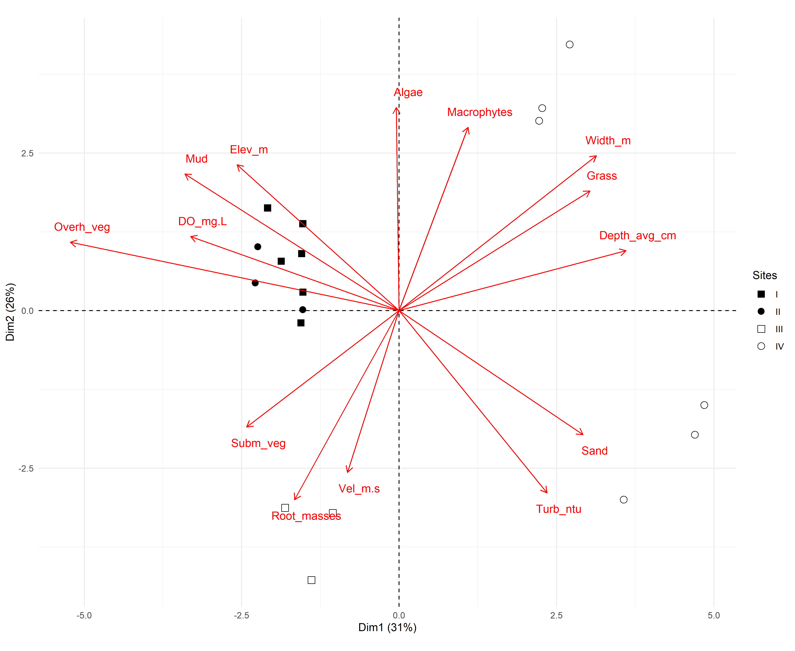

# Introduction

The devastation of rivers and streams from the Atlantic forest, biogeographical province [@udvardy1975] included in the list of the world's Hotspots (high biodiversity rates, endemism and anthropic pressure - [@myers2000], is caused mainly by pollution, deforestation, damming and introduction of exotic species. Pollution decreases abundance and richness of local fish, being aggravated by loss of riparian vegetation when there is deforestation or change of river course due to damming. These population reductions are also caused in the presence of invasive species, introduced accidentally or intentionally by humans, modifying the original competition/prey relation [@miranda2012]. With about 2-5% of the original vegetation preserved in Atlantic forest, one of the main strategies for conserving and preserving biodiversity from this and other biogeographical provinces is the delimitation of areas known as Conservative Units (CU), regulated in Brazil by the National System of Conservative Unit (SNUC) and implemented by Chico Mendes Institute (ICMBio) to be managed at federal, state and local levels [@miranda2012; @arruda2013].

Ecological data, such as richness and species abundance, are the most studied and represent how aquatic animals deal with general pollution, but the toxicity responsible for behavioral change depends on the organism, time of exposure and particle type, which demonstrates the need for physiological studies, specially in natural environments [@amoatey2019]. As physiological, morphological and behavioural aspects represent how their functions are performed in the ecosystem, they are nominated functional characteristics, commonly studied by parameters of strength and resilience. Changes on these parameters reflect environmental changes that could not be seen by parameters of taxonomical diversity, which happens when different species possess similar functions, highlighting how these, still scarce studies, can be promising [@júnior2021]. Taking it into account, as also the relevance of Conservation Units for the Atlantic forest species, this study brings up the possibility to compare the ecological health from these waterbodies by identifying physiological stress markers from the fish within and near CU's.

One of the main physiological functions affected by pollutants (such as pesticides, heavy metals, drugs and microplastics) is the osmoregulation one, that, as well as the pH control, is predominantly done by gills. Being also critical to gas exchange, ionic regulation and nitrogen excretion, its functions are partially performed by hormonal control of blood flow (carried out by catecholamines, which reduce vascular resistance in the gills and increase blood flow in the efferent artery via beta and alpha-adrenoreceptors, in that order) and mainly by the transport of ions, probably made in the chloride cells from the filament epithelium, that possess transport enzymes called sodium/potassium-dependent ATPases [@evans1987].

The action of toxic compounds in the gills leads to a series of histopathologies in response to stress, such as necrosis and epithelial desquamation, frequently generated by flaws in cellular osmoregulation due to ATPase inhibition and physiological failure of the chloride cells or gills as a whole. The effects of this action on the organism can be measured through a few blood markers, mainly lower levels of Chlorine and Sodium ions, obtained by freshwater fish through exchange with internal ions [@evans1987], and higher levels of plasmatic proteins [@sabae2015]. The hydration level of gills and muscles is another physiological parameter tied to the animal's capacity of dealing with salinity variation, and, for that, suffers mensurable effects from the action of toxic compounds in the environment. This active control parameter was suggested by @ayrapetyan2012 as a universal biomarker for detecting pollution in the environment, being upheld by @david2018 in a study with osmoconforming and euryhaline oysters under effect of different - but common - levels of salinity, and, more discretely, by @sabae2015 in a study with freshwater fish.

Another relevant biomarker is the abnormal activity of the multixenobiotic resistance (MXR) phenotype, an innate gene of many aquatic species that is expressed in organs such as gills, kidneys, blood-brain barrier, liver and pancreas. It is activated by exposure to pollutants and results in the production of P-glycoproteins (Pgp) in the membrane, which act to remove endogenous or exogenous toxic compounds out of the cell, protecting DNA and inducing its excretion. Although the MXR activity explains how some species are more resistant to the presence of pollutants, some substances can reverse its effectiveness, being called chemosensitizers (or simply MXR-inhibitors). Those compounds can cancel the Pgp activity, alter the mechanism regulation, saturate or even reverse MXR activity, acting, in this case, by saturating the Pgp pump and allowing other xenobiotics to enter the cell and increase its toxicity, even if the chemosensitizers themselves are not toxic. Precisely because they are mostly organic, natural, primarily harmless and very present in the materials emitted anthropogenic in nature, its detection should also be a priority in environmental risk studies [@smital1998].

The hypothesis of markers linked to physiological stress of fish providing evidence of the environmental stress levels occurring inside and outside of a Conservation Unity was tested in the Guaribas Environmental Reserve (ReBio Guaribas), one of the 22 CU's inside the Atlantic forest area of Paraíba state, located in the Zona da Mata, wettest and most economically relevant mesoregion from the state (@fig-mapa). Grouped, according to SNUC, as one of the integral protection areas (aimed to conserve biodiversity, being minority within the biogeographical province -- 33,45% of the CU's), the definition of environmental reserves prohibits human interference inside their limits, except for management actions that aim its preservation and recovery. Despite being one of the most restricted types of Conservation Units, there are 22 populations that influence ReBio Guaribas due to historic factors of occupation and absence of an effective buffer zone around the three areas that make up the reserve. Those populations are mainly rural and cause direct impact, by using wood and plants from the reserve, and indirect, causing siltation of rivers and contaminating groundwater through the use of septic tanks and releasing agricultural chemicals into the soil, promoting possible comparable ecophysiological responses in the ichthyofauna inside and around the CU [@arruda2013; @ministériodomeioambiente2025].

The ecophysiological evaluation of human impact on the forest, which is close to areas of monoculture and natural vegetation modified for livestock, was mainly guided by the fish species inventory of ReBio Guaribas made by @gouveia2017, in a study that lists 18 species from five different orders: Characiformes (12 species), Perciformes (3 species), Synbranchiformes (1 species), Siluriformes (1 species) e Cyprinodontiformes (1 species). From those, two are exotic - Oreochromis niloticus, second most farmed fish species in the world and tolerant to osmotic variation, and Poecilia reticulata, largely used in mosquito control and resistant to stressful environments [@miranda2012] - and none are listed as threatened. The predominance of small fish inhabiting small basins explains the higher level of endemism in streams, resulting from the allopatric speciation generated by the low dispersion made by these fish and the consequent isolation of populations [@gouveia2017]. Having in mind that these stream fish are phylogenetic close, this paper offers representative data for the entire local ichthyofauna using species of Hemigrammus genus, of the Characiformes order, characterized by a black conspicuous spot delimited on the dorsal fin. Its type species, Hemigrammus unilineatus, has a compressed and slightly elongated body and exhibits wide geographical distribution both in Central and South America, with registers in other Brazilian states, such as Alagoas and Pernambuco [@serra2010].

The identification of physiological stress biomarkers in the collected fish aims to evaluate the ecological health of sites inside and surrounding the CU, through quantitative comparison of the influence of anthropogenic action with data from a legally protected area (statistical analysis made in the integrated programming environment R and R Studio - [@rstudioteam; @rcoreteam2017]. This promotes a more tangible insight in contrast with other scientific papers that only make qualitative assessments of Conservative Units, and also using more specific markers than articles that only explore the ecological consequences of pollution exposure.

# Material and Methods

**Study area and sampling design.** This study was conducted in the Guaribas Biological Reserve (REBIO Guaribas), in northeastern Brazil, a protected area created in 1990 to preserve one of the last remnants of the Atlantic Forest [@mmai; @brasil2000f]. The reserve is located in the municipality of Mamanguape, state of Paraíba, in a heterogeneous landscape influenced by the adjacent Caatinga and Cerrado biomes. The regional climate is classified as As' [@köppen1928a], characterized by a rainy season from February to July and a dry period from October to December [@peel2007]. The average annual temperature varies from 24 to 26 °C, while the annual rainfall varies between 1,750 and 2,000 mm. The hydrographic network is composed of small streams fed by rain, notably the Barro Branco stream, a tributary of the Camaratuba River, where this study was carried out. These systems are influenced by riparian vegetation; however, parts of the buffer zone exhibit different levels of anthropogenic disturbance [@gouveia2017]. The surrounding landscape is predominantly agricultural, including sugarcane and coconut plantations, livestock farming, and small orchards. These land uses can act as sources of diffuse pollution, especially through pesticide runoff and domestic effluents, creating a spatial gradient of environmental disturbance [@mmai; @soler2004]. Sampling was conducted along the Barro Branco stream, comprising six sampling sites, and at each site, three subsamples were collected between November 2023 and February 2024. The sampling sites were distributed longitudinally to capture environmental variability and gradients of human influence. Sites P1 to P3 were located within the reserve, where more preserved conditions were expected, while sites P4 to P6 were situated in the buffer zone or in adjacent areas with greater human influence (@fig-mapa). This design aimed to include different levels of habitat integrity, riparian condition, and water quality.

For the sake of comparison, we classified all sites into four categories defined *a priori* (@fig-refsites). Reference site or Type I site, which are the sites that occur within the conservation unit and are well preserved, with intact riparian forest and no crop fields nearby (at least 1 km distant), free flowing water (≥ 0.25 m/s), high dissolved oxygen concentration (≥ 6 mg/L) and temperature below 28 °C. Type II sites, are those that occur within the conservation unit, but are not well preserved, failing in one or more of the water quality criteria and/or having its riparian vegetation removed or managed. Type III sites are those outside the conservation unit but meet the water quality criteria for a type I site, and type IV sites are those that fall outside the conservation unit and are also disturbed, not meeting the water quality criteria for a type I site. Sites type III and IV were intentionally chosen not to meet the riparian forest and crop proximity criteria. Since they fall outside of the REBIO they are not expected to have intact riparian forest or to be at least 1 km distant from a crop field.

**Environmental data collection.** Environmental characteristics of each sampling site were measured in four sets of variables: (a) site morphology, (b) water quality, (c) sediment composition, and (d) marginal habitat structure @medeiros2008. Site morphology was assessed by site width (cm) and depth (cm) and catchment scale variables (such as elevation and stream length) measured using handheld GPS and satellite imagery. Water quality was measured as physical and chemical variables using portable equipment for temperature (°C) and dissolved oxygen (mg/L). Transparency (cm) was measured using a Secchi disk and water velocity (m/s) was estimated using the float method @maitland1990. Sediment composition and the habitat physical structure followed protocols adapted by @medeiros2008 from [@pusey2004; @mugodo2006].

**Fish collection and maintenance.** Fish collection was conducted between October and November 2023 across six previously established sites (three inside the Reserva Biológica Guaribas and three in the surrounding area) using a hand net in a sweeping motion in shallow waters. Effort of capture was standardized across all sampling occasions and sites. To ensure specimen survival for the ecophysiological analyses, the fish caught were not chemically fixed; instead, they were immediately transferred to plastic bags containing local water and pumped air. Sorting, taxonomic identification, and subsequent experimental procedures were carried out at the Animal Ecophysiology Laboratory (LEFA) of Universidade Estadual da Paraíba (UEPB - campus V, João Pessoa, Brazil). To analyze osmoregulatory function, blood samples were taken from 78 individuals (38 from inside the reserve and 40 from the outside). For that, these fish were anesthetized with eugenol, and a blood aliquot was obtained by puncturing the heart using a pipette with a heparinized tip. The samples were kept on ice, and plasma was subsequently separated from cells by centrifugation. Due to the low plasma volume obtained from these small fish, the chlorine ions assay could not be performed. From those same specimens, gill and muscle were extracted in order to calculate the moisture content of tissues. Plasma and tissue samples were stored in a freezer at -20°C until the analyses were carried out. The remaining 111 individuals (54 from the reserve's interior and 57 from the exterior) were used in the multixenobiotic resistance (MXR) phenotype assay [@david2018; @macêdo2019; @santos2017].

**Plasmatic protein dosage.** The plasma samples were defrosted and an aliquot of 2 µL of each was diluted with 8 µL of distilled water (⅕ proportion) to perform the total protein dosage by the @bradford1976 method, in which the dye was also diluted in ⅕ proportion. The intensity of each sample coloration was measured with a microplate reader (SpectraMax i3) at 595 nm wave length, and compared to a standard curve (BSA protein). The results were transferred to a spreadsheet, where the average value in milligrams of protein dosage was calculated for each sampling site, and a Kruskal-Wallis test was performed to determine the existence of differences between the averages of the points inside and outside the Reserva Biológica Guaribas, calculated in the R Studio program [@rstudioteam]. Next, an analysis of variance (ANOVA) was performed to determine where there were differences between each sampling site.

**Moisture content.** The tissues samples (gill and muscle) were individually stored in 2 mL eppendorf tubes (previously weighted), initially weighted with the tissue moist, and, after 24 hours inside a 60°C oven, weighted with the dry tissue. The results were transferred to a spreadsheet, where it was calculated the percentual content of tissue water content and the average valor for each sampling site. A T-test (gill) or Krustal-Wallis test (muscle) was performed to determine if there were significant differences between the average values inside and outside the Conservative Unity, followed by an ANOVA to determine the difference between all six sampling sites.

**MXR phenotype activity.** The multixenobiotic resistance (MXR) gene activity was analysed through the rhodamine B accumulation assay adapted from @smital1998. Rhodamine B is a substrate of P-glycoprotein, the molecular basis of the MXR phenotype. Thus, after exposing the fish to this substrate, the analysis of the amount of rhodamine accumulated in the animal's tissues (mainly the gills) reflects the activity of the MXR phenotype: the greater the accumulation, the lower the activity, and the lower the accumulation, the greater the activity. Therefore, specimens of fish from each sampling site (three inside the Conservative Unity and three outside, total of six sampling sites) were transferred to plastic aquariums containing dechlorinated water and rhodamine B at 2,5 µM concentration, staying in this condition for one hour. The aquarium remained under constant aeration and protected from direct light. After exposition, the fish were anesthetized with eugenol and sacrificed for gill sampling. The tissue samples were allocated in Eppendorfs tubes and weighted in an analytical scale. The weight of moist tissue was obtained by subtracting the weight of the previously weighted empty eppendorf tubes.The tissues were then homogenized with 500 µL of distilled water and the supernatant was transferred in triplicate of 100 µL to a 96-well microplate. The fluorescence intensity of the supernatant (corresponding to the intracellular rhodamine B fluorescence in the tissue) was measured in the microplate reader (SectraMax i3) at 544 nm excitation and 590 nm emission. The fluorescence value was then normalized by the moist tissue weight in milligrammes, and a Kruskal-Wallis test was calculated in R Studio [@rstudioteam] to determine if there were differences between the averages inside and outside the Conservative Unity, followed by an ANOVA to visualize the differences between each sampling site.

**Statistical analysis.** Environmental variables were checked for multivariate collinearity and square root transformed before analyses @sokal1995.

```{r}
#| label: env-mxr23_org
#| eval: false
#| message: false
#| warning: false
#| code-fold: true
#| code-overflow: wrap
#| code-summary: "Code: Importing and organizing environment data"
#| results: false

#MXR23 - ORGANIZANDO DADOS----
#####....----

dev.off() #apaga os graficos, se houver algum
rm(list=ls(all=TRUE)) #limpa a memória
cat("\014") #limpa o console
#shell.exec(getwd())
getwd()
setwd("D:/Elvio/OneDrive/MSS/_Bentos-2006/Bentos2006_Q")
library(openxlsx)

##CARREGANDO MATRIZES BRUTAS----

habitat <- read.xlsx("D:/Elvio/OneDrive/MSS/_rebio23-mxr/mxr23_Q/data/rebio23-habitat.xlsx",
                     rowNames = T,
                     colNames = T,
                     sheet = "ambiente",
                     rows = 2:20)
habitat[1:5,1:5] #[1:5,1:5] mostra apenas as linhas e colunas de 1 a 5.
habitat[is.na(habitat)] <- 0
habitat

### REMOVENDO COLUNAS ZERADAS DE HABITAT----
sum <- colSums(habitat)
sum
zero_sum <- names(which(colSums(habitat) == 0))
zero_sum #nomes das colunas zeradas
m_part_cols <- habitat[(colSums(habitat) != 0)] #em != a exclamação inverte o sentido
zero_sum2 <- names(which(colSums(m_part_cols) == 0))
zero_sum2 #nomes das colunas zeradas
sum<-colSums(m_part_cols)
sum

t_grps <- read.xlsx("D:/Elvio/OneDrive/MSS/_rebio23-mxr/mxr23_Q/data/rebio23-habitat.xlsx",
                     rowNames = T,
                     colNames = T,
                     sheet = "grupos",
                     rows = 2:20)
t_grps


##SALVANDO MATRIZES FINAIS----

write.table(m_part_cols, "m_hab.csv",
            sep = ";", dec = ".", #"\t",
            row.names = TRUE,
            quote = TRUE,
            append = FALSE)
write.table(t_grps, "t_grps.csv",
            sep = ";", dec = ".", #"\t",
            row.names = TRUE,
            quote = TRUE,
            append = FALSE)
t_grps <- read.csv("t_grps.csv",
                   sep = ";", dec = ".",
                   row.names = 1,
                   header = TRUE,
                   na.strings = NA)
m_hab <- read.csv("m_hab.csv",
                   sep = ";", dec = ".",
                   row.names = 1,
                   header = TRUE,
                   na.strings = NA)
```

```{r}
#| label: env-mxr23_corr
#| eval: false
#| warning: false
#| message: false
#| results: false
#| code-fold: true
#| code-overflow: wrap
#| code-summary: "Code: Correlations of environment data" 

#MXR23----
####----

##ORGANIZANDO DADOS----

dev.off()
rm(list=ls(all=TRUE))
cat("\014")
t_grps <- read.csv("t_grps.csv",
                   sep = ";", dec = ".",
                   row.names = 1,
                   header = TRUE,
                   na.strings = NA)
m_hab <- read.csv("m_hab.csv",
                  sep = ";", dec = ".",
                  row.names = 1,
                  header = TRUE,
                  na.strings = NA)

##CORRELOGRAMA E REMOÇÃO DE VARIÁVEIS REDUNDANTES OU DESNECESSÁRIAS----

library(psych)
colnames(m_hab)

png("fig-h.hab_pairs.png")
pairs.panels(m_hab[,15:24],
             method = "pearson", # correlation method
             scale = FALSE, lm = FALSE,
             hist.col = "#00AFBB", pch = 19,
             density = TRUE,  # show density plots
             ellipses = TRUE, # show correlation ellipses
             alpha = 0.5)
dev.off()

cor <- cor(m_hab)
cor

library(corrplot)
png("fig-hab_corrplot.png")
corrplot(cor, method = "circle")
dev.off()

#### IMPRESSÃO EM PAPEL
#win.print()
#corrplot(cor, method = "circle")
#dev.off()

##DELETANDO COLINEARES----

#sink(file = "colineares.txt", append = F, split = T)
#colnames(m_hab)
#del_cols <- c() #"g.river_length","g.altitude" #NÃO DELETEI VARIÁVEIS
#m_hab_part <- m_hab[, !(colnames(m_hab) %in% del_cols)]

##SOMANDO REDUNDANTES----

#m_hab_part$s.gravel <- m_hab_part$s.smlgrav + m_hab_part$s.lrggrav + m_hab_part$s.cobbles
#m_hab_part <- m_hab_part[, !(colnames(m_hab_part)
#                             %in% c("s.smlgrav", "s.lrggrav", "s.cobbles"))]
#m_hab_part$s.rock <- m_hab_part$s.rocks + m_hab_part$s.bedrock
#m_hab_part <- m_hab_part[, !(colnames(m_hab_part)
#                             %in% c("s.rocks", "s.bedrock"))]
#m_hab_part$h.algae <- m_hab_part$h.filalgae + m_hab_part$h.attalgae
#m_hab_part <- m_hab_part[, !(colnames(m_hab_part)
#                             %in% c("h.filalgae", "h.attalgae"))]
#m_hab_part$h.debris <- m_hab_part$h.smldeb + m_hab_part$h.lrgdeb
#m_hab_part <- m_hab_part[, !(colnames(m_hab_part)
#                             %in% c("h.smldeb", "h.lrgdeb"))]

#colnames(m_hab_part)
#m_hab_part
#sink()

write.table(m_hab, "m_hab_part.csv",
            sep = ";", dec = ".", #"\t",
            row.names = TRUE,
            quote = TRUE,
            append = FALSE)
m_hab_part <- read.csv("m_hab_part.csv",
                       sep = ";", dec = ".",
                       row.names = 1,
                       header = TRUE,
                       na.strings = NA)
```

These variables were subsequently subjected to Principal Component Analysis (PCA) to evaluate multivariate correlations among sites. Prior to analysis, site morphology and water quality variables were square root transformed, whereas sediment composition and the marginal habitat structure (which were measured as percentages) were arcsine square-root transformed after relativization by column total @mccune2002. PCA was performed using the `FactoMineR` package in R @lê2008. All variables were centered and scaled to unit of variance.

```{r}
#| label: env-PCA_org
#| eval: false
#| warning: false
#| message: false
#| results: hide
#| code-fold: true
#| code-overflow: wrap
#| code-summary: "Organizing Environment data PCA"

#PCA fviz package----
#browseURL("https://www.sthda.com/english/articles/31-principal-component-methods-in-r-practical-guide/112-pca-principal-component-analysis-essentials/")

#ORGANIZANDO DADOS----

dev.off()
rm(list=ls(all=TRUE))
cat("\014")

t_grps <- read.csv("t_grps.csv",
                   sep = ";", dec = ".",
                   row.names = 1,
                   header = TRUE,
                   na.strings = NA)
m_hab_part <- read.csv("m_hab_part.csv",
                  sep = ";", dec = ".",
                  row.names = 1,
                  header = TRUE,
                  na.strings = NA)

colnames(m_hab_part)
#fix(m_hab_part)

###RELATIVIZAÇÕES E TRANSFORMAÇÕES----
m_hab_trns <- sqrt(m_hab_part)
#m_hab_trns[m_hab_trns == -Inf] <- 0
#m_hab_trns$g.altitude <- NULL #DELETA COLUNA

# Salvado m_hab_trns
write.table(m_hab_trns, "m_hab_trns.csv",
            sep = ";", dec = ".", #"\t",
            row.names = TRUE,
            quote = TRUE,
            append = FALSE)
m_hab_trns <- read.table("m_hab_trns.csv",
                  sep = ";", dec = ".",
                  row.names = 1,
                  header = TRUE,
                  na.strings = NA)
```

# Results

**Environmental variables.** Water flow was present only in smaller streams in lower altitudes (sites 4-6) and during the rainy season (0.10-0.17 m/s). Stream sites tended to be narrower with widths ranging from 5.4 to 29.6 m, compared with 72.2 to 330 m for reservoirs. Littoral depths varied widely from 4.7 to 81.3 cm across all sites. Dissolved oxygen (DO) ranged from 1.8 to 9.4 mg/L and temperatures from 24.0 and 35.2 °C. Turbidity was low with Secchi depths reaching 90 cm, even though some sites had depths as low as 16 cm of the Secchi disk. Mud and sand were the main substrates across all sampled sites (with average covers of 54.4 and 37.9%, respectively). The habitat elements that gave greater overall contributions were attached and filamentous algae (12% on average), littoral grass (9.0%) and aquatic macrophytes (8.4%), but these contributions varied widely across sites and season..

```{r}
#| label: tbl_hab
#| eval: false
#| warning: false
#| message: false
#| results: false
#| code-fold: true
#| code-overflow: wrap
#| code-summary: "Code: Environment data table" 

#TABELA DE HABITAT----

m_hab_part <- read.csv("m_hab_part.csv",
                       sep = ";", dec = ".",
                       row.names = 1,
                       header = TRUE,
                       na.strings = NA)
t_grps <- read.csv("t_grps.csv",
                   sep = ";", dec = ".",
                   row.names = 1,
                   header = TRUE,
                   na.strings = NA)

library(dplyr)
library(tidyr)
m_trab <- m_hab_part %>%
  rename_with(~ gsub("_", ".", .))
m <- m_trab %>%
  group_by(PontoN = t_grps$PontoN) %>%
  summarise(across(where(is.numeric),
                   list(mean = mean, min = min, max = max)),
            .groups = 'drop') %>%
  pivot_longer(
    cols = -c(PontoN),
    names_to = c("Variable", ".value"),
    names_sep = "_"
  )

m <- as.data.frame(m)
m_wide <- m %>%
  mutate(stat_string = ifelse(Variable == c("m.Vel.m.s"),
                              paste0(round(mean, 3), " (", round(min, 3), "-", round(max, 3), ")"),
                              paste0(round(mean, 1), " (", round(min, 1), "-", round(max, 1), ")"))) %>%
  unite("Location", PontoN, sep = "_") %>%
  select(Variable, Location, stat_string) %>%
  pivot_wider(names_from = Location, values_from = stat_string)

m_wide
m_wide <- as.data.frame(m_wide)
m_wide <- m_wide[, c("Variable", "Ponto5", "Ponto6", "Ponto7", "Ponto8", "Ponto9", "Ponto10")]
m_wide

# Salvado m_wide
write.table(m_wide, "m_wide_hab.txt",
            sep = ";", dec = ".", #"\t",
            row.names = TRUE,
            quote = TRUE,
            append = FALSE)
m_wide_hab <- read.table("m_wide_hab.txt",
                  sep = ";", dec = ".",
                  row.names = 1,
                  header = TRUE,
                  na.strings = NA)

# Exportando dados para Excel
library(openxlsx)
#write.xlsx(m_wide, file = "tabela de habitat.xlsx", rowNames = FALSE)
wb <- loadWorkbook("tabela de habitat.xlsx")
writeData(wb, sheet = "Sheet 1", x = m_wide)
saveWorkbook(wb, "tabela de habitat.xlsx", overwrite = TRUE)

```

```{r}
#| label: hab_var_summ
#| eval: false
#| warning: false
#| message: false
#| results: false
#| code-fold: true
#| code-overflow: wrap
#| code-summary: "Code: Environment data variable summary"

# Escolher sumário de uma variavel
m
var <- "w.Temp.C"
m[m$Variable == var, "mean"] #cada valor de var
summary(m[m$Variable == var, "mean"]) #sumário dos valores de var

# Escolher sumário de um grupo de variáveis do df m
vars <- unique(grep("^h\\.", m$Variable, value = TRUE))
summaries <- list() #criam uma lista vazia para guardar os sumários
# Loop para cada variável do grupo e guarda em summaries
for (var in vars) {
  summaries[[var]] <- summary(m[m$Variable == var, "mean"])
}
#var is a temporary variable used in the for loop to iterate through
#each variable name that starts with "h."

summaries
summary_table <- do.call(rbind, lapply(summaries, as.data.frame.list))
round(summary_table, 2)
#sink(file = "summary_h.txt", split = TRUE)
round(summary_table[order(summary_table$Mean, decreasing = FALSE), ], 2)
#sink()

# Tabela limpa
#summary_table <- cbind(Variable = rownames(summary_table), summary_table)
#rownames(summary_table) <- NULL
#colnames(summary_table) <- c("Variable", "Min", "Q1", "Median", "Mean", "Q3", "Max")
#summary_table
```

```{r}
#| label: hab_gttable
#| eval: false
#| warning: false
#| message: false
#| results: hide
#| code-fold: true
#| code-overflow: wrap
#| code-summary: "Code: Environment data GT table"

library(readr)
library(dplyr)
library(gt)

m_wide_hab <- read.table("m_wide_hab.txt",
                  sep = ";", dec = ".",
                  row.names = 1,
                  header = TRUE,
                  na.strings = NA)

#m_mapa <- read_tsv("column_labels.txt", show_col_types = FALSE)
dados <- m_wide_hab
dados
nomes <- names(dados)[-1]
nomes

df_nomes <- data.frame(
  original = nomes,
  final    = nomes,
  stringsAsFactors = FALSE)

df_nomes
df_nomes$final <- gsub("_", "<br>", df_nomes$final)
dados <- mutate(dados,across(-Variable, ~ gsub(" \\(", "<br>(", .)))
#fix(df_nomes)
#write.table(df_nomes, "df_nomes.txt")
df_nomes <- read.table("df_nomes.txt")

labels_finais <- setNames(
  lapply(df_nomes$final, md),
  nomes)

tabela_gt <- dados %>%
  gt(rowname_col = "Variable") %>%
#  tab_header(
#    title = "Características Ambientais",
#    subtitle = "Valores apresentados como média (mín–máx)"
#  ) %>%
  fmt_markdown(
    columns = -Variable) %>%
  cols_align(
    align = "right",
    columns = -Variable) %>%
  cols_label(.list = labels_finais)

tabela_gt
gtsave(tabela_gt, "gt-hab_gttable.html")
gtsave(tabela_gt, "fig-hab_gttable.png")
saveRDS(tabela_gt, "gt-hab_gttable.rds")

# Tabela final ajustada no Excel
library(readxl)
hab_gttable <- read_excel(
  path  = "tabela de habitat.xlsx",
  sheet = "tabela_final",
  range = "A1:G25")
hab_gttable
library(gt)
hab_gttable <- gt(hab_gttable)
hab_gttable <- sub_missing(hab_gttable,
                      columns = everything(), missing_text = "")
#hab_gttable <- fmt_number(hab_gttable, columns = "F.O.(%)", decimals = 1)
hab_gttable
gtsave(hab_gttable, "gt-hab_gttable_xlsx.html")
saveRDS(hab_gttable, "gt-hab_gttable_xlsx.rds")
```

Principal Component Analysis described the overall structure of the study sites and the most important features in separating them in terms of their physical and chemical variables, site morphometry, sediment composition, and marginal habitat structure @fig-hab_PCA_fviz. PCA explained 41.9% of the variance in the environmental variables, with the first axis (27.6%) showing a gradient from large reservoirs to smaller streams sites. Large scale morphology variables such as altitude, river length and site width were important to describe most reservoirs, whereas river sites were better described by local physical, chemical and habitat variables, such as margins depth and water temperature. Among the habitat structure variations, overhanging vegetation and roots, were also important to describe stream sites. Larger reservoirs were mostly associated with a muddy substrate whereas river sites included a more diverse array of substrates, the most important being sand and gravel. Other variables such as slope (morphology), submerged vegetation and leaf litter (habitat structure) and water velocity (water quality) were important in explaining specific sites at given sampling occasions.

```{r}
#| label: env-PCA_fviz
#| eval: false
#| warning: false
#| message: false
#| results: hide
#| code-fold: true
#| code-overflow: wrap
#| code-summary: "Environment data PCA - fviz"

#PCA fviz package----
#browseURL("https://www.sthda.com/english/articles/31-principal-component-methods-in-r-practical-guide/112-pca-principal-component-analysis-essentials/")

#ORGANIZANDO DADOS----

dev.off()
rm(list=ls(all=TRUE))
cat("\014")

t_grps <- read.csv("t_grps.csv",
                   sep = ";", dec = ".",
                   row.names = 1,
                   header = TRUE,
                   na.strings = NA)
m_hab_part <- read.csv("m_hab_part.csv",
                  sep = ";", dec = ".",
                  row.names = 1,
                  header = TRUE,
                  na.strings = NA)
m_hab_trns <- read.table("m_hab_trns.csv",
                  sep = ";", dec = ".",
                  row.names = 1,
                  header = TRUE,
                  na.strings = NA)

#PCA----

library("FactoMineR")
library("factoextra")

pca <- PCA(m_hab_trns, scale.unit = TRUE, ncp = 5, graph = TRUE)
print(pca)

eig.val <- get_eigenvalue(pca)
eig.val

sink(file = "pca_cor_matrix.txt", append = FALSE)
pca$var$cor
sink()

fviz_eig(pca, addlabels = TRUE) #, ylim = c(0,35)

var <- get_pca_var(pca)
var

fviz_pca_var(pca, col.var = "black")

library("corrplot")
corrplot(var$cos2, is.corr=FALSE)

fviz_cos2(pca, choice = "var", axes = 1:2)

fviz_pca_var(pca, col.var = "cos2",
             gradient.cols = c("#00AFBB", "#E7B800", "#FC4E07"),
             repel = TRUE # Avoid text overlapping
)

fviz_pca_var(pca, alpha.var = "cos2")

corrplot(var$contrib, is.corr=FALSE)

fviz_contrib(pca, choice = "var", axes = 1, top = 10)
fviz_contrib(pca, choice = "var", axes = 2, top = 10)
fviz_contrib(pca, choice = "var", axes = 1:2, top = 10)

fviz_pca_var(pca, col.var = "contrib",
             gradient.cols = c("#00AFBB", "#E7B800", "#FC4E07")
)
fviz_pca_var(pca, alpha.var = "contrib")

##GROUPING BY KMEANS----

set.seed(123)
res.km <- kmeans(var$coord, centers = 3, nstart = 25)
grp <- as.factor(res.km$cluster)
# Color variables by groups
fviz_pca_var(pca, col.var = grp,
             palette = c("#0073C2FF", "#EFC000FF", "#868686FF"),
             legend.title = "Cluster")

ind <- get_pca_ind(pca)
ind
ind$contrib

##BIPLOTS----

fviz_pca_ind(pca)

fviz_pca_ind(pca, col.ind = "cos2",
             gradient.cols = c("#00AFBB", "#E7B800", "#FC4E07"),
             repel = TRUE #avoid text overlapping (slow if many points)
)

fviz_pca_ind(pca, pointsize = "cos2",
             pointshape = 21, fill = "#E7B800",
             repel = TRUE #avoid text overlapping (slow if many points)
)

fviz_pca_ind(pca, col.ind = "cos2", pointsize = "cos2",
             gradient.cols = c("#00AFBB", "#E7B800", "#FC4E07"),
             repel = TRUE #avoid text overlapping (slow if many points)
)

fviz_cos2(pca, choice = "ind")

fviz_contrib(pca, choice = "ind", axes = 1:2)

# Create a random continuous variable of length 23,
# Same length as the number of active individuals in the PCA
nrow(m_hab_part)
set.seed(123)
my.cont.var <- t_grps$Ref_site
my.cont.var
# Color individuals by the continuous variable
fviz_pca_ind(pca, col.ind = my.cont.var,
             gradient.cols = c("blue", "yellow", "red"),
             legend.title = "Cont.Var",
             repel = FALSE)

fviz_pca_ind(pca,
             geom.ind = "point", #show points only (nbut not "text")
             col.ind = as.factor(my.cont.var), #color by groups
             palette = "grey",
             addEllipses = TRUE, #concentration ellipses
             legend.title = "Groups"
)

length(unique(my.cont.var))
fviz_pca_ind(pca,
             geom.ind = "point",
             col.ind = as.factor(t_grps$Ref_site),
             palette = "grey",
             addEllipses = TRUE, ellipse.type = "confidence",
             mean.point = TRUE,
             legend.title = "Groups")

fviz_pca_biplot(pca, repel = TRUE,
                col.var = "#2E9FDF", #variables color
                col.ind = "#696969"  #individuals color
)

fviz_pca_biplot(pca,
                col.ind = as.factor(t_grps$Ref_site), palette = "jco",
                addEllipses = TRUE, elipse.type = "euclid",
                label = "var",
                col.var = "black", repel = TRUE,
                legend.title = "Species")

#GRAFICO FINAL----

fviz_pca_biplot(pca, repel = TRUE,
                col.var = "red", #variables color
                col.ind = "black"  #individuals color
)

library(factoextra)
library(ggplot2)

# Convert t_grps$UA to a factor to ensure distinct shapes
t_grps$Ref_site <- as.factor(t_grps$Ref_site)

# Generate the PCA biplot with individuals in black
fviz_pca_biplot(pca, repel = TRUE,
                            col.var = "red",  #cariables color
                            col.ind = "black", #all individuals in black
                            geom = c("point", "text"))

# Generate the PCA biplot with individuals in black
library(ggrepel) #geom_text_repel
png("fig-hab_PCA_fviz.png", width = 11, height = 9, units = "in", res = 400)
fviz_pca_biplot(pca_filt, repel = TRUE, repel.var = TRUE,
                            col.var = "red",  #variables color
                            col.ind = "black", #all individuals in black
                            geom = c("text")) +  #c("point", "text", "")remove default individuals
  geom_point(aes(shape = t_grps$Ref_site), size = 3) + #map shapes to t_grps$UA
#  geom_text_repel(aes(label = t_grps$Ref_site), direction = "both") + # direction = "x" or "y", label UAs from t_grps$UA, library(ggrepel)
  scale_shape_manual(values = c(15, 16, 0, 1, 2, 17)) +  #adjust shape values
  theme_minimal()  #clean theme
dev.off()

###FILTRANDO VETORES PRINCIPAIS
var_coord <- pca$var$coord[, 1:2]
keep_vars <- apply(abs(var_coord) > 0.5, 1, any)
keep_vars
vars_to_keep <- rownames(var_coord)[keep_vars]
vars_to_keep
# Create a filtered PCA object
pca_filt <- pca
pca_filt$var$coord <- pca$var$coord[vars_to_keep, , drop = FALSE]
pca_filt$var$contrib <- pca$var$contrib[vars_to_keep, , drop = FALSE]
pca_filt$var$cos2 <- pca$var$cos2[vars_to_keep, , drop = FALSE]

###FIX VARIABLES COORDINATES----
var_coords <- as.data.frame(pca$var$coord)
# Manually adjust positions (modify values as needed)
#var_coords$Dim.1 <- var_coords$Dim.1 * 4.7  #shift right
#var_coords$Dim.2 <- var_coords$Dim.2 * 4.7  #shift up
#Fine tunning
#fix(var_coords)
#write.table(var_coords, "coords_var.txt")
var_coords <- read.table("coords_var.txt")
#rownames(var_coords) <-
#  substr(rownames(var_coords), 3, nchar(rownames(var_coords))) #remove os 2 primeiros caracteres

###FIX INDIVIDUALS COORDINATES----
ind_coords <- as.data.frame(pca$ind$coord)
# Manually adjust positions (modify values as needed)
#ind_coords$Dim.1 <- ind_coords$Dim.1 + 0  #shift right
#ind_coords$Dim.2 <- ind_coords$Dim.2 + 0.2  #shift up
#Fine tunning
#fix(ind_coords)
#write.table(ind_coords, "coords_ind.txt")
ind_coords <- read.table("coords_ind.txt")
#rownames(ind_coords) <-
#  substr(rownames(ind_coords), 5, nchar(rownames(ind_coords))) #remove os 4 primeiros caracteres

#PLOT----

png("fig-hab_PCA_fviz.png", width = 11, height = 9, units = "in", res = 400)
fviz_pca_biplot(pca, repel = FALSE,
                col.var = "red", col.ind = "black",
                geom = "none", #remove default labels
                label = "none") +  #remove both variable & individual labels
# Add manually adjusted variable labels
  geom_text(data = var_coords, aes(x = Dim.1, y = Dim.2, label = rownames(var_coords)),
            color = "red", size = 4) +
# Add manually adjusted individual labels
  geom_text(data = ind_coords, aes(x = Dim.1, y = Dim.2, label = rownames(ind_coords)),
            color = "black", size = 4, nudge_x = 0, nudge_y = 0) +  #corrected column names
  geom_point(aes(shape = t_grps$UA), size = 3) + #map shapes to t_grps$UA
  scale_shape_manual(values = c(15, 16, 0, 1, 2, 17)) +
  theme_minimal() + ggtitle(NULL) + labs(shape = "Sites") +
  theme(legend.text = element_text(size = 14),  #increase legend text size
        legend.title = element_text(size = 16)) +  #increase legend title size
  guides(shape = guide_legend(override.aes = list(size = 4))) #increase legend symbols
dev.off()
```

```{r, HAB-PCA_rbase}
#| label: hab_PCA_rbase
#| eval: false
#| warning: false
#| message: false
#| results: hide
#| echo: false
#| purl: false
#| code-fold: true
#| code-overflow: wrap
#| code-summary: "Environment data PCA - R Base"

#PCA R base----

dev.off() #apaga os graficos, se houver algum
rm(list=ls(all=TRUE)) #limpa a memória
cat("\014") #limpa o console

t_grps <- read.csv("t_grps.csv",
                   sep = ";", dec = ".",
                   row.names = 1,
                   header = TRUE,
                   na.strings = NA)
m_hab <- read.csv("m_hab.csv",
                  sep = ";", dec = ".",
                  row.names = 1,
                  header = TRUE,
                  na.strings = NA)
m_dens <- read.csv("m_dens.csv",
                   sep = ";", dec = ".",
                   row.names = 1,
                   header = TRUE,
                   na.strings = NA)

m_hab_part <- read.csv("m_hab_part.csv",
                       sep = ";", dec = ".",
                       row.names = 1,
                       header = TRUE,
                       na.strings = NA)

colnames(m_hab_part)
m_hab_trns <- sqrt(m_hab_part)

data <- m_hab_part
library("tidyverse")

# Inserindo coluna para agrupamentos
nrow(data); ncol(data) #no. de N colunas x M linhas
data_g <- cbind(Grupos = rownames(data), data)

grps <- substr(data_g[, 1], 5,6)
grps

data_g <- data_g %>% mutate(Grupos=c(grps))
data_g

###FAZENDO A MÉDIA POR PONTO----
#data_avg <- aggregate(data_g[, 9:9], list(data_g$Grupos), mean)
#data_avg

data_avg <- data_g %>%
  group_by(Grupos) %>%
  summarise(across(.cols = everything(), ~ mean(.x, na.rm = TRUE)))
data_avg

# Primeira coluna para nomes das linhas
data_avg <- as.data.frame(data_avg)
class(data_avg)
rownames(data_avg) <- data_avg[,1]
data_avg[,1] <- NULL
#data_avg <- round(data_avg, 1)
data_avg

# Salvando a matriz
write.table(data_avg,
            "data_avg.csv",
            append = F,
            quote = TRUE,
            sep = ";", dec = ",",
            row.names = T)
data_avg <- read.csv("data_avg.csv",
                        sep = ";", dec = ",",
                        header = T,
                        row.names = 1,
                        na.strings = NA)

#m_hab_trns <- sqrt(data_avg)

#browseURL("https://cran.r-project.org/web/packages/LearnPCA/vignettes/Vig_03_Step_By_Step_PCA.pdf")
###PCA - para todos os pontos----
p <- prcomp(m_hab_trns, scale = T, center = T)
p
biplot(p)
s <- summary(p)
s

###ORGANIZANDO GRUPOS DE INFORMAÇÕES PARA O GRÁFICO----
nrow(m_hab_trns)
pch.group <- c(rep(21, times=4), rep(22, times=4), rep(23, times=3),
               rep(24, times=3), rep(25, times=4), rep(25, times=4))
col.group <- c(rep("yellow", times=4), rep("blue", times=4), rep("green", times=3),
               rep("red", times=3), rep("grey", times=4), rep("black", times=4))
pos.group <- c(rep("1", times=nrow(t_grps)))
pos <- as.data.frame(cbind(tag=t_grps$tag, pos.pca=pos.group))
#fix(pos) #edita
#write.table(pos, "posit.txt")
pos <- read.table("posit.txt")
pos$col <- col.group #adiciona uma coluna nova
pos$pch <- pch.group #adiciona uma coluna nova
pos

png("fig-hab_PCA_rbase.png", width = 7, height = 7, units = "in", res = 400)
par(mar=c(4.5, 4.5, 1, 1))
plot(p$x[,1], p$x[,2],
     xlab=paste("PCA 1 (", round(s$importance[2]*100, 1), "%)", sep = ""),
     ylab=paste("PCA 2 (", round(s$importance[5]*100, 1), "%)", sep = ""),
     col="black", cex=1.5, las=1, asp=1,
     pch=pos$pch_bw, bg=pos$col_bw)

abline(v=0, lty=2, col="grey50")
abline(h=0, lty=2, col="grey50")
text(p$x[,1], p$x[,2], labels=row.names(p$x), pos=pos$pos.pca, font=1, cex=0.7)

# Tamanho das setas
l.x <- p$rotation[,1]*9
l.y <- p$rotation[,2]*9

arrows(x0=0, x1=l.x, y0=0, y1=l.y, col="red", length=0.1, lwd=1)

# Label position das setas
l.pos <- l.y #create a vector of y axis coordinates
lo <- which(l.x < 0) #get the variables on the bottom half of the plot
hi <- which(l.x > 0) #get variables on the top half

# Replace values in the vector
l.pos <- replace(l.pos, lo, "2")
l.pos <- replace(l.pos, hi, "4")
l.pos["m.depth_hab"] <- "1"
l.pos["s.mud"] <- "1"
l.pos["fq.w_vel"] <- "2"
#   1
# 2   4
#   3

text(l.x, l.y, labels=row.names(p$rotation), col="red", pos=l.pos, cex=0.7)

# Legend
library(dplyr)
legend <- pos %>%
  mutate(group = sub(".*-(..)-.*", "\\1", tag)) %>%  #extract CI, SA, etc.
  distinct(group, col, pch, col_bw, pch_bw)
legend
legend("bottomleft", legend = legend$group,
       col = "black", pt.bg = legend$col_bw, pch = legend$pch_bw,
       pt.cex = 1, cex = 1)
dev.off()

tab <- matrix(c(p$x[,1], p$x[,2]), ncol=2)

# Calculate correlations
c1 <- cor(tab[1:4,])
c2 <- cor(tab[5:8,])
c3 <- cor(tab[9:11,])
c4 <- cor(tab[12:14,])
c5 <- cor(tab[15:18,])
c6 <- cor(tab[19:22,])

# Plot ellipse
library(ellipse)
polygon(ellipse(c1*(max(abs(p$rotation))*1), centre=colMeans(tab[1:4,]), level=0.95), col=adjustcolor("blue", alpha.f=0.25), border="blue")
polygon(ellipse(c2*(max(abs(p$rotation))*1), centre=colMeans(tab[5:8,]), level=0.95), col=adjustcolor("green", alpha.f=0.25), border="green")
polygon(ellipse(c3*(max(abs(p$rotation))*1), centre=colMeans(tab[9:11,]), level=0.95), col=adjustcolor("yellow", alpha.f=0.25), border="yellow")
polygon(ellipse(c4*(max(abs(p$rotation))*1), centre=colMeans(tab[12:14,]), level=0.95), col=adjustcolor("red", alpha.f=0.25), border="red")
polygon(ellipse(c5*(max(abs(p$rotation))*1), centre=colMeans(tab[15:18,]), level=0.95), col=adjustcolor("orange", alpha.f=0.25), border="orange")
polygon(ellipse(c6*(max(abs(p$rotation))*1), centre=colMeans(tab[19:22,]), level=0.95), col=adjustcolor("pink", alpha.f=0.25), border="pink")

# Load package
library("factoextra")
# Create groups
group <- as.factor(t_grps$UA)
group
# Plot
fviz_pca_biplot(p, repel=TRUE, pointsize=6, pointshape=21,
                col.var="red", arrowsize=0.6, labelsize=5,
                col.ind=group, palette=c("blue", "green", "yellow", "red", "orange", "pink"),
                addEllipses=TRUE, ellipse.level=0.95)
```

```{r, HAB-PCA_results_table}
#| label: hab_PCA_results_table
#| eval: false
#| warning: false
#| message: false
#| results: hide
#| echo: false
#| purl: false
#| code-fold: true
#| code-overflow: wrap
#| code-summary: "Results table for PCA environment data PCA"

#PCA R base----

dev.off() #apaga os graficos, se houver algum
rm(list=ls(all=TRUE)) #limpa a memória
cat("\014") #limpa o console

# Eigenvalues & variance explained
eig.val <- get_eigenvalue(pca)
eig_table <- data.frame(
  PC = rownames(eig.val),
  Eigenvalue = eig.val[, "eigenvalue"],
  Variance_percent = round(eig.val[, "variance.percent"], 2),
  Cumulative_variance_percent = round(eig.val[, "cumulative.variance.percent"], 2),
  row.names = NULL)
eig_table

# Variable loadings (correlations) for retained PCs
n_pc <- 2 #number of PCs
loadings <- pca$var$coord[, 1:n_pc]

loadings_table <- data.frame(
  Variable = rownames(loadings),
  round(loadings, 3),
  row.names = NULL)
colnames(loadings_table)[-1] <- paste0("PC", 1:n_pc)
loadings_table

# Variable contributions (%) to each PC
contrib <- pca$var$contrib[, 1:n_pc]
contrib_table <- data.frame(
  Variable = rownames(contrib),
  round(contrib, 2),
  row.names = NULL)
colnames(contrib_table)[-1] <- paste0("PC", 1:n_pc, "_contrib")
contrib_table

# Combined report-ready table
pca_report_table <- merge(
  loadings_table,
  contrib_table,
  by = "Variable",
  sort = FALSE)
rownames(pca_report_table) <- pca_report_table[, 1]
pca_report_table <- pca_report_table[, -1]
pca_report_table

# Save tables
sink(file = "pca_table.txt", split = T)
pca_report_table
sink()
```

**Fish community.** A total of 422 individuals were collected. Fish were distributed among 6 species, 2 families, and a single order Characiformes. Among the families recorded, Characidae was the richest with 5 species, Astyanax bimaculatus, Astyanax fasciatus, Hemigrammus marginatus, Hemigrammus rodwayi, and Hemigrammus unilineatus, while Crenuchidae was represented by only 1 species, Characidium bimaculatum, with a single specimen collected. The most abundant species were Hemigrammus unilineatus (45.2% of the individuals colleted). Other abundant species were Hemigrammus rodwayi (23.7%) and Hemigrammus marginatus (18.2%), establishing Hemigrammus as the dominant genus in the study area. Regarding their spatial distribution, only 1 species (H. unilineatus) was present at the sites located inside the Reserva Biológica Guaribas, whereas all 6 species were recorded in the surrounding areas. Out of the total collected fish, 118 specimens were submitted to the rhodamine B accumulation assay (MXR), 78 were used for total plasmatic protein dosage and moisture content quantification, and 226 individuals died prior to the physiological procedures.

```{r}
#| label: non-used-code-01
#| eval: false
#| warning: false
#| message: false
#| results: false
#| code-fold: true
#| code-overflow: wrap
#| code-summary: "non-used code" 

table(1:10)
```

**Plasmatic protein dosage.** The average plasmatic protein concentration, parameter that is positively correlated to environmental stress, was of 32,2 mg in the sampling sites within the Reserva Biológica Guaribas (n = 18 plasma samples) and 80,1 mg in the outside sites (n=26), revealing an almost 150% higher concentration in the sites with greater human influence. The total number of plasmatic protein dosages (n=44) was smaller than the total number of collected fish for this part of the analysis (n=78) because of the difficulty on collecting blood from smaller specimens, in addition to the need to collect a minimum amount of plasma required by the Bradford method. After checking the non-normality of variance of the total protein data, a non parametric Kruskal-Wallis test confirmed the existence of statistically significant difference (p-value\<0,005) between the data collected from fish inside and outside the Conservative Unity (@fig-boxtpinandout).

```{r, CHUNK-boxplot_protein}
#| eval: false
#| message: false
#| warning: false
#| results: false
#| echo: true
#| purl: false
#| code-fold: true
#| code-overflow: wrap
#| code-summary: "Code: Total Plasmatic Proteins (mg)"

library(readxl) 
library(gplots) 
library(agricolae)
library(sciplot)
library(PMCMRplus)
library(corrplot)
library(psych)
library(scales)
library(visreg)
citation()
dir()
setwd("C:/Users/Mirelly/Downloads/mxr23_Q")
tcc=read.csv("Dados_TCC.csv", h=T, stringsAsFactors = T, dec=",") 
#TP
hist(tcc$TP, probability = T)
lines(x=density(x=tcc$TP, na.rm=T, adjust=2)) #parece um pouco
shapiro.test(tcc$TP) #0,001 = não normal
bartlett.test(tcc$TP~tcc$Local) #0,000001765 = não homo ###kruskal
kruskal.test(tcc$TP~tcc$Local) #0,00000002328 = diferem

par(mfrow=c(1,1),mar=c(3,5,1,1),lwd=1)
boxplot(tcc$TP~tcc$Local)
boxplot(tcc$TP~tcc$Local,axes=F, varwidth=T, xlab="",ylab="", border="black", col=c("darkgreen","darkred"), ylim=c(15,140), outline = T, main="", horizontal = F)
box(bty="o", lwd=2)
axis(side=2,las=1,font=2)
nomes=c("INSIDE","OUTSIDE")
pos=c(1,2)
axis(side = 1,at = pos, labels = nomes, las=1,font=9)
mtext(text="Total Plasmatic Proteins (mg)", side=2,line=3,cex=1,font=7)
legend("topleft", legend=c("Kruskal-Wallis test demonstrated", "statistical difference", "(p-value=0,00000002328)"), text.font = 2, bty="n", cex=0.6, text.col="gray25")
```

The subsequent ANOVA test confirmed the uniformity of values from the sites inside the reserve (all grouped as "a"), differently from the outside sites (@fig-boxtpsites).

```{r, CHUNK-boxplot_sampling_site}
#| eval: false
#| message: false
#| warning: false
#| results: false
#| echo: true
#| purl: false
#| code-fold: true
#| code-overflow: wrap
#| code-summary: "Code: Total plasmatic proteins by sampling site"

anova(lm(formula=tcc$TP~tcc$Site)) #0,00000000000002783 = diferença
(tkPT=HSD.test(y=lm(formula=tcc$TP~tcc$Site),trt="tcc$Site",group=T)) 
boxplot(tcc$TP~tcc$Site) #a,a,a,c,b,bc #dentro e fora muito mais isolados
 
par(mfrow=c(1,1),mar=c(3,5,1,1),lwd=0.75)
boxplot(tcc$TP~tcc$Site,axes=F, varwidth=T, xlab="",ylab="", border="black", col=c("darkgreen","darkgreen","darkgreen","darkred","darkred","darkred"), ylim=c(20,140), outline = T, main="", horizontal = F)
box(bty="o", lwd=2)
axis(side=2,las=1,font=2)
nomesP=c("P5","P6","P7","P8","P9","P10")
posP=c(1,2,3,4,5,6)
axis(side = 1,at = posP, labels = nomesP, las=1,font=9)
mtext(text="Total Plasmatic Protein (mg)", side=2,line=3,cex=1,font=7)
tapply(tcc$TP,tcc$Site,max, na.rm=T)
text(x=c(1,2,3,4,5,6),y=c(34,35.2,35.6,98,98,87.7)+7,labels=c("a","a","a","c","b","bc"),cex=1)
```

The increase of total plasmatic protein concentration in the animals exposed to pollution is consistent with the [@sabae2015] study, which attributes this increase to five possibilities: activation of metabolic systems as answer to pollutants exposure, degradation of cellular material in the liver, severe pathological conditions in the liver and kidneys, loss of water in the plasma, and induction of proteic synthesis in the liver.

**Moisture content.** The average values of moisture content, parameter related to the osmoregulatory function, were 84,3% for the gill and 80,3% for the muscle of fish inside the ReBio Guaribas (n=38 fish). Regarding the fish from sampling sites surrounding the reserve (n=40), the averages were 88,9% for the gills and 82,3% for the muscle, increasing, in order, only about 5,6% and 2,5% the values from inside, results that are not very expressive, like the ones described by @haredi2020. However, through T test (gills, which data had normal variation) and Kruskal-Wallis test (muscle, with non-normal variation data), it was detected statistical difference for both tissues between fish from the sampling sites inside and outside the Guaribas (@fig-mcsites).

```{r, CHUNK-boxplot_moisture_content}
#| eval: false
#| message: false
#| warning: false
#| results: false
#| echo: true
#| purl: false
#| code-fold: true
#| code-overflow: wrap
#| code-summary: "Code: Moisture content (gills and muscle)"

#TH_B = GMC
hist(tcc$GMC, probability = T)
lines(x=density(x=tcc$GMC, na.rm=T, adjust=2)) #quase
shapiro.test(tcc$GMC) #0,06 = normal
bartlett.test(tcc$GMC~tcc$Local) #0,7455 = homo ###teste t
t.test(tcc$GMC~tcc$Local) #0,002728 = diferem

par(mfrow=c(2,1),mar=c(2,5,1,1),lwd=1)
boxplot(tcc$GMC~tcc$Local)
boxplot(tcc$GMC~tcc$Local,axes=F, varwidth=T, xlab="",ylab="", border="black", col=c("darkgreen","darkred"), ylim=c(70,103), outline = T, main="", horizontal = F)
box(bty="o", lwd=2)
axis(side=2,las=1,font=2)
nomes=c("INSIDE","OUTSIDE")
pos=c(1,2)
axis(side = 1,at = pos, labels = nomes, las=1,font=9)
mtext(text="Gill Moisture", side=2,line=3.5,cex=0.9,font=7)
mtext(text="Content (%)", side=2,line=2.7,cex=0.9,font=7)
legend("top", legend=c("p-value=0,002728"), text.font = 2, bty="n", cex=0.55, text.col="gray25")

#MMC
hist(tcc$MMC, probability = T)
lines(x=density(x=tcc$MMC, na.rm=T, adjust=2)) #parece
shapiro.test(tcc$MMC) #0,002 = não normal
bartlett.test(tcc$MMC~tcc$Local) #0,047 = não homo ###kruskal
kruskal.test(tcc$MMC~tcc$Local) #0,000004813 = diferem

par(mfrow=c(1,1),mar=c(1,5,5,1),lwd=1)
boxplot(tcc$MMC~tcc$Local)
boxplot(tcc$MMC~tcc$Local,axes=F, varwidth=T, xlab="",ylab="", border="black", col=c("darkgreen","darkred"), ylim=c(70,100), outline = T, main="", horizontal = F)
box(bty="o", lwd=2)
axis(side=2,las=1,font=2)
nomes=c("INSIDE","OUTSIDE")
pos=c(1,2)
axis(side = 1,at = pos, labels= nomes, las=1,font=9)
mtext(text="Muscle Moisture", side=2,line=3.5,cex=0.9,font=7)
mtext(text="Content (%)", side=2,line=2.7,cex=0.9,font=7)
legend("top", legend=c("p-value=0,000004813"), text.font = 2, bty="n", cex=0.55, text.col="gray25")
```

The ANOVA test demonstrated similarity between data from sites inside ReBio Guaribas (P5, P6 and P7) and P8, and a lesser similarity with P9, that was also close to P10 (@fig-boxmmcsites).

```{r, CHUNK-boxplot_ANOVA_moisture_content}
#| eval: false
#| message: false
#| warning: false
#| results: false
#| echo: true
#| purl: false
#| code-fold: true
#| code-overflow: wrap
#| code-summary: "Code: Moisture content by site"

anova(lm(formula=tcc$GMC~tcc$Site)) #0,0000004971 = diferença
(tkTHB=HSD.test(y=lm(formula=tcc$GMC~tcc$Site),trt="tcc$Site",group=T)) 
boxplot(tcc$GMC~tcc$Site) #a,a,ab,a,bc,c ##P8 próximo aos de dentro, p9 e p10 mais isolados

par(mfrow=c(1,1),mar=c(2,5,1,1),lwd=0.75)
boxplot(tcc$GMC~tcc$Site,axes=F, varwidth=T, xlab="",ylab="", border="black", col=c("darkgreen","darkgreen","darkgreen","darkred","darkred","darkred"), ylim=c(70,103), outline = T, main="", horizontal = F)
box(bty="o", lwd=2)
axis(side=2,las=1,font=2)
nomesP=c("P5","P6","P7","P8","P9","P10")
posP=c(1,2,3,4,5,6)
axis(side = 1,at = posP, labels = nomesP, las=1,font=9)
mtext(text="Gill Moisture", side=2,line=3.5,cex=0.9,font=7)
mtext(text="Content (%)", side=2,line=2.7,cex=0.9,font=7)
tapply(tcc$GMC,tcc$Site,max, na.rm=T)
text(x=c(1,2,3,4,5,6),y=c(91.3,94.3,98.1,89.1,97.1,97.9)+3,labels=c("a","a","ab","a","bc","c"),cex=1)
```

The overall statistical analysis performed for moisture content reinforces this as a more discreet and inefficient parameter to make direct quantitative comparison for animals exposed to low salinity variation from the environment, but still accurate in determining the uniformity degree of more representative groups (i.e., fish from inside and outside the Conservative Unity).

**MXR phenotype activity.** The average values of normalized fluorescence measured in fish gills were 25.449 rfu/mg (relative fluorescence units/milligramme of tissue) for inside the Conservative Unity (n=54 fish) and 67.138,3 rfu/mg for outside (n=57), value nearly 2,64 times bigger. This difference between averages is opposite to the expected (higher fluorescence signals a lower MXR phenotype activity, meaning a lower exposition to pollutants), that can be explained by the presence of MXR phenotype inhibitors, which were highly correlated to more polluted waters by @kurelec2000. Among the possible pollutants presents, pesticides, fragrances, microbial degradation products and natural inhibitors from invasive species were described as compounds with high affinity to the Pgp or inhibiting the PKC (protein kinase C) modulator, resulting in high accumulation of rhodamine B [@smital2004] Despite the unexpected result, the variance difference between data from the MXR phenotype activity inside and outside the ReBio Guaribas (confirmed by the Kruskal-Wallis test and illustrated in (@fig-fluorescence)

```{r, CHUNK-boxplot_MXR}
#| eval: false
#| message: false
#| warning: false
#| results: false
#| echo: true
#| purl: false
#| code-fold: true
#| code-overflow: wrap
#| code-summary: "Code: MXR phenotype activity (inside x outside)"

#MXR
hist(tcc$MXR, probability = T)
lines(x=density(x=tcc$MXR, na.rm=T, adjust=2)) #não parece
shapiro.test(tcc$MXR) #0,0000038 = não normal
bartlett.test(tcc$MXR~tcc$Local) #0,000264 = não homo ##kruskal
kruskal.test(tcc$MXR~tcc$Local) #0,0000000000005607 = diferem

par(mfrow=c(1,1),mar=c(3,6,1,1),lwd=1)
boxplot(tcc$MXR~tcc$Local)
boxplot(tcc$MXR~tcc$Local,axes=F, varwidth=T, xlab="",ylab="", border="black", col=c("darkgreen","darkred"), ylim=c(6400,151000), outline = T, main="", horizontal = F)
box(bty="o", lwd=2)
axis(side=2,las=1,font=2)
nomes=c("INSIDE","OUTSIDE")
pos=c(1,2)
axis(side = 1,at = pos, labels = nomes, las=1,font=9)
mtext(text="Fluorescence/Mass of Tissue (rfu/mg)", side=2,line=4.5,cex=1,font=7)
legend("topleft", legend=c("Kruskal-Wallis test demonstrated", "statistical difference", "(p-value=0,0000000000005607)"), text.font = 2, bty="n", cex=0.6, text.col="gray25")
```

was also the most conclusive when analysed by ANOVA test, being the only physiological parameter that shows total uniformity for both relationship with the reserve (@fig-boxmxr).

```{r, CHUNK-boxplot_MXR_site}
#| eval: false
#| message: false
#| warning: false
#| results: false
#| echo: true
#| purl: false
#| code-fold: true
#| code-overflow: wrap
#| code-summary: "Code: MXR activity by sampling site"

anova(lm(formula=tcc$MXR~tcc$Site)) #0,0000000000005 = diferença
(tkMXR=HSD.test(y=lm(formula=tcc$MXR~tcc$Site),trt="tcc$Site",group=T)) 
boxplot(tcc$MXR~tcc$Site) #a,a,a,b,b,b #dentro e fora 100% isolados

dunnMXR=kwAllPairsDunnTest(formula=tcc$MXR~tcc$Site)
summary(dunnMXR) #ad,b,ab,c,c,cd

par(mfrow=c(1,1),mar=c(3,6,1,1),lwd=0.75)
boxplot(tcc$MXR~tcc$Site,axes=F, varwidth=T, xlab="",ylab="", border="black", col=c("darkgreen","darkgreen","darkgreen","darkred","darkred","darkred"), ylim=c(4000,165000), outline = T, main="", horizontal = F)
box(bty="o", lwd=2)
axis(side=2,las=1,font=2)
nomesP=c("P5","P6","P7","P8","P9","P10")
posP=c(1,2,3,4,5,6)
axis(side = 1,at = posP, labels = nomesP, las=1,font=9)
mtext(text="Fluorescence/Mass of Tissue (rfu/mg)", side=2,line=4.5,cex=1,font=7)
tapply(tcc$MXR,tcc$Site,max, na.rm=T)
text(x=c(1,2,3,4,5,6),y=c(68400,31371,44811,88000,150658,121050)+10000,labels=c("a","a","a","b","b","b"),cex=1)
```

**Abiotic data.** The abiotic data from every sampling site water was measured and reunited in Tab. 1. The abnormal proportion of ammonia indicates the presence of effluents in the water outside the Reserva Biológica Guaribas, and, as discussed by [@piedras2006], this elevated concentration generates metabolic ammonia retention, causing toxicity. The same paper also points out that the toxicity of non-ionized ammonia in the aquatic environment is greater for smaller organisms, but depends on the interaction with other environmental variables, such as temperature, pH and salinity, demanding specific studies with the target species to determine their tolerance to ammonia.The Pearson correlation analysis among biotic data showed only one significant correlation, between Total Protein and MXR phenotype activity (0,6 - moderate and positive), and among abiotic data only two significance, between Nitrate e Phosphor (0,69 - moderate and positive) and between Dissolved Oxygen and Ammonia (-0,82 - strong and negative). It was also detected significant correlation among both data, between Gill Moisture Content and Ammonia (0,55 - moderate and positive), between Gill Moisture Content and Dissolved Oxygen (-0,62 - moderate and negative), and between MXR activity and Nitrate (-0,62 - moderate and negative).

# Discussion

All parameters were effective to point out statistical differences between data from inside the ReBio Guaribas and its surroundings, highlighting - alongside the higher levels of ammonia in the water and plasmatic proteins in the fish - that changes in the environment are impacting the fish from the streams studied. Beyond that, the statistical analysis of physiological parameters from fish collected inside the Conservation Unity showed uniform results among its three sampling sites, consistent with what is expected from natural environments with little human influence. The same did not occur among the three sites outside the CU (with the exception of the MXR phenotype activity), indicating the action of different levels of environmental stress. The differences between the average results from the physiological parameters measured inside and outside the Conservation Unity were illustrated in the @fig-bar, highlighting the total protein as one that proved itself as an excellent biomarker to detect pollutants in the aquatic environment.

```{r, CHUNK-mean_physiological_markers}
#| eval: false
#| message: false
#| warning: false
#| results: false
#| echo: true
#| purl: false
#| code-fold: true
#| code-overflow: wrap
#| code-summary: "Code: Proportion of mean physiological markers"

md=colMeans(tcc[grep("inside",x=tcc$Local),c(3:6)],na.rm = T)
mf=colMeans(tcc[grep("outside",x=tcc$Local),c(3:6)],na.rm = T)
(médias=matrix(c(md,mf),byrow=T,nrow = 2,ncol=4,dimnames=list(c("inside","outside"),c("GMC","MMC","TP","MXR"))))
(prop=proportions(médias,2))
par(mfrow=c(1,1),mar=c(3,4,1,1),lwd=1)
barplot(height = prop, horiz = T, las=1, col = c("darkgreen", "darkred"), legend.text = T)
```

These preliminary obtained data were precise to indicate significant differences among the conditions in which the fish inhabited. But as much MXR phenotype activity data were as disparate as the ones of total protein and even more precise to point out the uniformity among sampling sites inside and outside the ReBio Guaribas, it showed values opposite to what was expected, with higher fluorescence in the tissue of fish outside the reserve, normally indicating lower MXR phenotype activity. This inconsistency can be explained by the possible presence of chemosensitizers in the water, since the fish did not went through a decontamination period, and thus, pollutants could still be bound to the active Pgp site and preventing rhodamine B to attach to it. The presence of such chemosensitizers can be quantified through the creation of a calibration curve, as described by [@kurelec2000], but, until done, the relevance of the MXR phenotype analysis must be restricted to the statistical context.

From the final results, an important positive evaluation can be made regarding the environmental protection that the Conservative Unity does within its extension, even when analysing one with historical problems of delimitation and still not entirely free of anthropic impacts. Adding the fact that it is located within the Atlantic forest, classified as a Hotspot, the verification of the efficiency of a CU in this biogeographical province is even more relevant, reinforcing the need for governments to create more legally protected areas as a key strategy to reduce global ecological crisis. This study also made an important description on the use of physiological biomarkers in ecological analysis, raising ecophysiology potential as a basis to future assays, which can be incorporated into effectiveness index such as seen in [@masullo2020a] paper and presenting quantifiable data that can complement studies with analysis of historical and geographical data, such as the one from [@assis2021].

# Conclusions {.unnumbered}

# Acknowledgements {.unnumbered}

We are grateful to Thainá da Silva Oliveira for assistance with laboratory activities; and to Ellen Gomes da Silva for assistance with fieldwork activities. ACP and ASB are grateful to Programa de Pós-Graduação em Ecologia e Conservação (PPGEC-UEPB) and CAPES for scholarship grated. MMSM and LRCS are grateful to Programa de Iniciação Científica (PIBIC-UEPB) and CNPq for scholarship granted.

# Authorship contribution statement {.unnumbered}

Authorship of this paper is based on @credit2026.

Adamastor Coutinho Pinto: Conceptualization, Data curation, Formal analysis, Investigation, Software, Visualization, Writing -- review & editing, Writing -- original draft.

Mayara Mirelly da Silva Monteiro: Data curation, Formal analysis, Software, Writing -- review & editing.

Alice da Silva Barros: Data curation, Formal analysis, Software, Writing -- review & editing.

Larissa Rafaela Caetano da Silva:Data curation, Formal analysis, Software, Writing -- review & editing.

Enelise Marcelle Amado: Conceptualization, Data curation, Methodology, Project administration, Resources, Supervision, Validation, Writing -- review & editing.

Elvio Sergio Figueredo Medeiros: Conceptualization, Data curation, Formal analysis, Funding acquisition, Methodology, Project administration, Resources, Software, Supervision, Validation, Writing -- review & editing.

# Ethical approval {.unnumbered}

Fish collection was authorized by the Instituto Chico Mendes de Conservação da Biodiversidade (license SISBIO-89415-2) and the project was approved by the Ethics Committee on Animal Use of the State University of Paraíba (protocol CEUA-048/2023).

# References {.unnumbered}

::: {#refs}
:::

\pagebreak
\newpage

# Figures and Tables {.unnumbered}

## Figures {.unnumbered}

{#fig-mapa}

{#fig-refsites}

{#fig-hab_PCA_fviz}


{#fig-boxtpinandout}

{#fig-boxtpsites}

{#fig-mcsites}

{#fig-boxmmcsites}

{#fig-fluorescence}

{#fig-boxmxr}

{#fig-bar}

## Tables {.unnumbered}

\pagebreak
\newpage

# Apendices {.unnumbered}

# Non-used figures and tables {.unnumbered}

::: callout-warning
# Non-used codes

```{r}
#| label: non-used code
#| eval: false
#| warning: false
#| message: false
#| results: false
#| code-fold: true
#| code-overflow: wrap
#| code-summary: "non-used code" 

table(1:10)
```
:::
